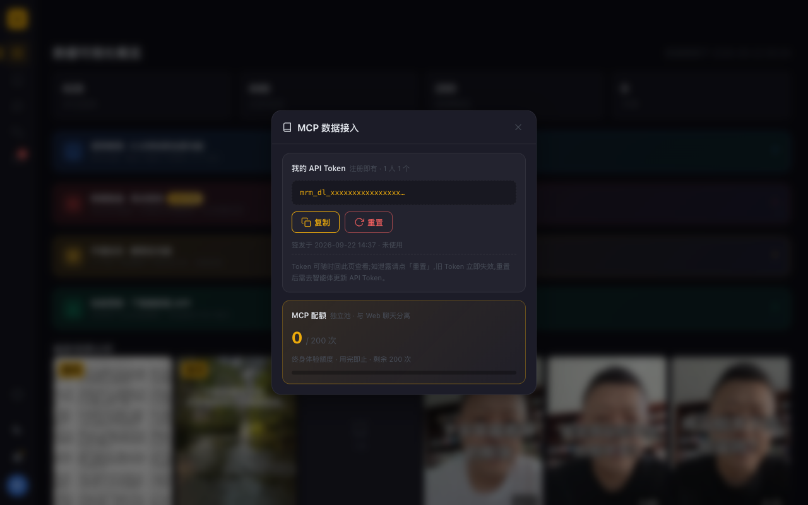

# M-Model — A 股财经视频 MCP 调用框架

[](https://github.com/Cesario-Lzc/M-Model)
[](https://mcp.cesario.top)
[](#license)

> 15 个 MCP 工具，5 基础 + 6 高级 + 4 功能，A 股财经视频全维度分析（博主观点 / 视频检索 / 转录 / 评论热词 / 多空情绪 / 8 维框架 / 平台热词 / **结构化观点追踪 / 每日晨报 / 免费探额探测**）。
>
> **数据源**：目前仅收录财经博主「模型先生」的 A 股视频数据；后续将接入更多博主，以 [官网最新公告](https://mrmodel.cesario.top) 为准。

## 快速开始

**前置**：注册 mrmodel 账号（[mrmodel.cesario.top](https://mrmodel.cesario.top)）——**注册即得 MCP token（1 人 1 个）+ 200 quota 终身体验额度，15 个 tool 全部可用，无需付费**。

登录后打开 [mrmodel.cesario.top/mcp-tokens](https://mrmodel.cesario.top/mcp-tokens)，直达「MCP 数据接入」面板——Token 明文就在面板里，点「复制」即用：



> Token 可随时回该面板查看；如泄露点「重置」即换新，重置后需到智能体更新 API Token。

```bash
# 从源仓库直拉最新安装脚本（GitHub raw，始终最新版；备用镜像见脚本头部说明）
curl -sL https://raw.githubusercontent.com/Cesario-Lzc/M-Model/main/install-mrmodel-skill.sh | bash
```

脚本自动探测你机器上已有的智能体宿主并全部装入，装有 MCP 配置的文件同步写入/更新。装完打开你的智能体客户端，按 SKILL.md §1 触发词直接用人话问。

## Agent 自动安装（面向 AI 智能体，任意宿主通用）

安装脚本专为「让 agent 代跑」设计：**不锁死宿主、非交互不卡死、结果可判读**。任何智能体平台（Claude Code / WorkBuddy / Cursor / CodeBuddy / 豆包 等）都可一行命令完成安装。

### 宿主安装矩阵（自动探测，全装）

| 探测路径（存在即装入） | 宿主 |
|---|---|
| `~/.claude/skills/mr-model` | Claude Code |
| `~/.workbuddy/skills/mr-model` | WorkBuddy |
| `~/.cursor/skills/mr-model` | Cursor |
| `~/.codebuddy/skills/mr-model` | CodeBuddy |
| `~/.doubao/agent_mode/workspace/.user_skills/mr-model` | 豆包 |

- 上述都不存在 → fallback 装 `~/.claude/skills/mr-model`
- 自定义单目录：`MRMODEL_SKILL_DIR=/your/path bash install-mrmodel-skill.sh`

### 安装契约 5 步（脚本自动完成）

1. **探测宿主**：扫描上表路径，存在的宿主全部装入
2. **落盘 skill**：SKILL.md + OUTPUT-REFERENCE.md（CDN 直拉优先，sha256 与内嵌副本比对防旧版，失败 fallback 内嵌）
3. **写 token**：env `MR_MCP_TOKEN` → 已有 token 文件 → 交互询问（非交互环境不卡死，跳过并给补配指引）
4. **写 MCP 配置**：向已有宿主配置（`~/.workbuddy/mcp.json`、`~/.claude.json`、`~/.cursor/mcp.json` 等）写入/更新 `mr-model` 条目（url + Bearer + `X-Skill-Version`，原文件自动 `.bak` 备份）
5. **验证**：healthz 探活 + tools/list 鉴权（15 tool 全可见）

### env 契约

| 变量 | 作用 |
|---|---|
| `MRMODEL_SKILL_DIR` | 显式指定 skill 安装目录（跳过宿主探测） |
| `MRMODEL_TOKEN_FILE` | 显式指定 token 文件路径（默认 `~/.config/mrmodel/token`） |
| `MRMODEL_MCP_URL` | 显式指定 MCP 端点（默认 `https://mcp.cesario.top/mcp`） |
| `MR_MCP_TOKEN` | 直接传 token（免交互） |

### 参数与退出码

```bash
bash install-mrmodel-skill.sh --list-targets   # 打印宿主安装矩阵，不安装
bash install-mrmodel-skill.sh --dry-run        # 全流程预演，不落盘
```

| 退出码 | 含义 |
|---|---|
| `0` | 完全成功（含鉴权通过） |
| `1` | 脚本自身错误 |
| `2` | skill 已装好但缺 token（agent 按输出指引补配即可） |
| `3` | 鉴权失败（token 无效 / status 非 active / 配额打爆） |

## 它能做什么

### 5 基础 tool（视频/搜索/评论）

| 能力 | 工具 | 输入 | 输出示例 |
|------|------|------|----------|
| 视频列表（支持增量） | `query_video_list` | `page=1` 或 `date_from/to` / `since_id` | 20 条 video 元信息（CST 日界过滤 / 增量游标） |
| 关键词搜视频 | `search_videos` | `query="光模块 CPO"`（多词 OR，v1.4.6） | 20 条命中视频 desc |
| 博主观点时间线 | `query_blogger_opinions` | `keyword="贵州茅台 白酒", limit=20`（多词 OR，v1.4.6） | 20 条视频的 8 维框架 + dialectics_tags |
| 转录片段搜 | `search_video_transcripts` | `keyword="光模块", limit=20` | 20 段转录 snippet（≤65 字含前后文） |
| 博主发言聚合（可选原文） | `query_comments` | `aweme_id="..."`, `include_samples=true` | 博主本人发言统计 + TOP5 评论原文（匿名） |

### 6 高级 tool（单视频深挖/聚合/meta）

| 能力 | 工具 | 输出示例 |
|------|------|----------|
| 单视频全字段 | `query_real_desc_text` | 全字段元信息 + 8 维框架 |
| 8 维档位 | `query_dimension_levels` | 8 维 × {level 0/1/2 + label} |
| 转录 5 类分析 | `query_transcript_keywords` | 词频 Top50 + NER + 词性 + 关键句 + 摘要 prompt |
| 多空情绪聚合 | `query_aggregated_sentiment` | long/short 计数 + 比值 + 拐点 + TOP 引文（多 keyword 分组对比，v1.4.6） |
| 博主 meta | `query_creator_meta` | `{total_videos, videos_last_30d, ...}` |
| 平台热词 | `query_trending_keywords` | 50 词 × {top/new/rising} |

### 4 功能 tool（v1.4.0 新增，2 个免费）

| 能力 | 工具 | 成本 | 输出示例 |
|------|------|------|----------|
| 查配额余量 | `query_quota` | **免费** | `{limit, used, remaining, reset_at, is_lifetime}` |
| 探测新视频 | `check_new_video` | **免费** | `{latest_aweme_id, has_new}`（轮询神器） |
| 结构化观点追踪 | `query_stock_opinions` | 2+0.1/行 | **多标的批量**：空格分隔传个股/板块/概念，按标的分组返回历次看多/看空 + 时效 + 推理原文（"300308"也能查） |
| 每日晨报 | `get_daily_digest` | **动态 1.5/期 ceil**（0 期免费） | **近 5 期动态**（当天没更新也照常有货）+ 多空方向 + 评论热词 |

**调用事例**（每日自动化晨报，近 5 期 = 8 quota vs 散件 10+ quota）：

```python
# 每日定时：先免费探测，有更新才跑收费晨报
quota = call("query_quota")                                    # 免费
if call("check_new_video", known_id=last_id)["has_new"]:      # 免费
    digest = call("get_daily_digest")                          # 动态计费 1.5/期 ceil（近 5 期 = 8；0 期免费）
    # → 新视频 + 多空方向 + 评论热词
# 用户问"中际旭创最近怎么说"（结构化观点直达，cost=4）
opinions = call("query_stock_opinions", symbol_or_name="中际旭创", date_from="2026-08-08", limit=20)
# → direction / validity / reasoning / viewpoint_date 观点行，客户端 LLM 自行组织分析
```

## Example Prompts：装完就能问

装好后对 Claude 直接说人话即可，无需记任何参数。每条后面标注的是背后自动调用的工具。

**每日节奏**

- 「今天博主发了什么新视频？各自讲了啥？」→ `get_daily_digest`
- 「博主更新了没？」→ `check_new_video`（免费）
- 「给我整理一份今天的晨报，带观点方向和评论区热词」→ `get_daily_digest`

**个股 / 板块观点追踪**

- 「中际旭创最近被怎么看？给了哪些理由？」→ `query_stock_opinions`
- 「300308 历次观点和原话都列出来」→ `query_stock_opinions`（纯代码也能查）
- 「光模块这个板块博主是看多还是看空？」→ `query_stock_opinions`
- 「白酒板块博主最近三周的态度有变化吗？」→ `query_stock_opinions`（配 date_from/date_to）
- 「我持仓里贵州茅台、宁德时代，博主分别怎么评价的？」→ `query_stock_opinions`（多标的批量）

**观点检索与原文**

- 「博主聊过 AI 算力的视频有哪些？」→ `search_videos`
- 「找一下博主提到"预期差"的原话片段」→ `search_video_transcripts`
- 「博主对创业板最近的完整分析框架」→ `query_blogger_opinions`
- 「把最新那期视频的完整观点维度展开」→ `query_real_desc_text`

**评论与市场热词**

- 「最近一期视频评论区都在聊什么？」→ `query_comments`
- 「平台现在什么关键词最热？」→ `query_trending_keywords`
- 「博主提到铜和黄金时，看多看空的比例是多少？」→ `query_aggregated_sentiment`

**进阶组合（观点雷达）**

- 「拉一份最近 30 天博主对半导体链的观点全景：方向分布 + 高频理由 + 原话金句，最后输出一页 markdown」→ `query_stock_opinions` + `query_blogger_opinions` + `search_video_transcripts` 组合
- 「对比博主和上一季度对同一批核心标的的态度变化」→ `query_stock_opinions`（多标的 + 时间窗）
- 「先看我还有多少额度，再决定跑全量还是精简版」→ `query_quota`（免费）+ 任意

> 更多模式见 [SKILL.md](SKILL.md) §4.4 观点雷达（盘前/盘后/周报/单标的轨迹/多标的对比，一套流程换参数）。

## 配额成本

> **公式**：`cost = ⌈base + 行数 × per⌉ quota`（向上取整，防拖库；dict 返回走 base 单次；`get_daily_digest` 例外——按返回期数动态计 1.5/期 ceil，0 期 0）
> **单位**：**quota**（配额点；Pro 享 3000 quota / 30 天滚动窗口，其余档位人人享 200 quota 终身体验额度，一次性不按月重置）

### 免费 tool（0 quota）

| Tool | 用途 |
|------|------|
| `query_quota` | 自动化流程开头探余额 |
| `check_new_video` | 高频轮询"更新了没" |

### 收费 tool

| Tool | base | per×N | 典型成本 |
|------|------|-------|----------|
| `query_video_list` / `search_videos` | 1 | 0.1×N | 20 行 → **3 quota** |
| `query_blogger_opinions` / `query_stock_opinions` | 2 | 0.1×N | 20 行 → **4 quota** |
| `search_video_transcripts` | 2 | 0.05×N | 20 段 → **3 quota** |
| `query_comments` / `query_real_desc_text` / `query_dimension_levels` / `query_creator_meta` | 1 | 0 | **1 quota** |
| `query_transcript_keywords` / `query_aggregated_sentiment` / `query_trending_keywords` | 2 | 0 | **2 quota** |
| `get_daily_digest` | — | 1.5/期 | **动态**：0 期 0 / 1 期 2 / 近 5 期 8（顶替散件 10+ quota 联调） |

## 免费体验与升级

**免费体验**：**所有账号均享 200 quota 终身体验额度**（注册即有，一次性赠送不按月重置，15 tool 全部可用，无需付费；轻量查询约可问 6 个问题）。

**升级 Pro**：享 3000 quota / 30 天 + 15 tool 全量，价格以[官网会员页](https://mrmodel.cesario.top)公告为准。

**升级路径**：登录 [mrmodel.cesario.top](https://mrmodel.cesario.top) → 头像 → 会员中心 → 选 Pro → 支付 → 约 1-5 分钟自动生效（token 注册即有，无需申请，升级后同一 token 直接享大配额）。

**1 token 跨设备通用**（iPhone / Mac / Linux 同一 token 都享对应档位配额，1 用户 1 API key；完整明文随时在 [mcp-tokens 面板](https://mrmodel.cesario.top/mcp-tokens)查看/复制，泄露点「重置」即换新）。

## 合规能力

本 skill 返回的是**博主观点、视频/转录/评论聚合、结构化 claims 等事实数据**，供您结合自有行情数据源和大模型进行分析。**不下发操作指令（买入/卖出/仓位等）**，**不替您作投资建议**。

## 保持更新

本 skill 建议保持最新版。重跑一行安装命令即可升级到最新版（脚本会顺带把你的客户端版本写入 MCP 配置）：

```bash
curl -fsSL https://raw.githubusercontent.com/Cesario-Lzc/M-Model/main/install-mrmodel-skill.sh | bash
```

首次运行时会询问是否授权「自动静默更新」，授权一次后后续版本会在检测到更新时自动覆盖、不再二次打扰。

## 链接

- **MCP 服务**：[mcp.cesario.top](https://mcp.cesario.top)（Bearer token 鉴权）
- **官网 Web / API**：[mrmodel.cesario.top](https://mrmodel.cesario.top)
- **Token 查看/复制/重置**：[mrmodel.cesario.top/mcp-tokens](https://mrmodel.cesario.top/mcp-tokens)（注册即有 · 1 人 1 个）
- **完整文档**：[SKILL.md](SKILL.md)（15 tool 决策树 + 双模式输出规范 + 合规硬闸）+ [OUTPUT-REFERENCE.md](OUTPUT-REFERENCE.md)（15 tool 返回 JSON 结构参考）

## License

MIT — 自由使用，需保留版权声明。
