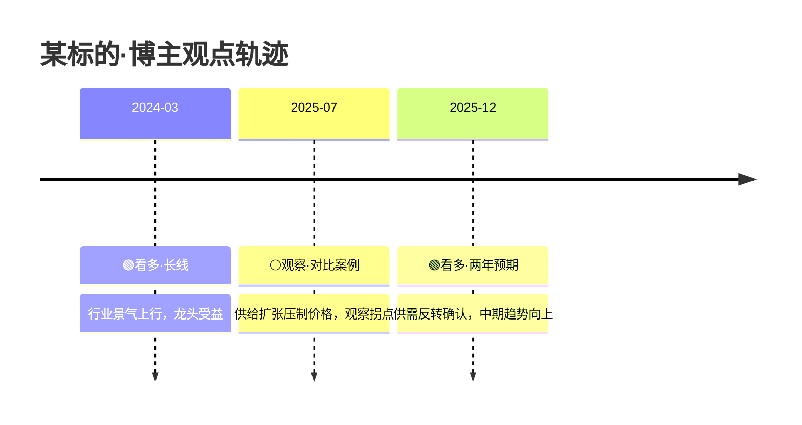

# mrmodel-skill — mr-model MCP 调用框架

> **本 skill 不是投资框架，不是博主方法论，不是新分析体系。**
> 它**只是**一个 MCP 调用框架 + 输出规范化层 + 自更新外壳。
> 服务端只返**事实数据**（视频/转录/评论聚合/结构化观点行），**不下发任何分析框架或方法论字段**；
> 所有分析逻辑由客户端 LLM 基于事实数据自行组织（多空对照、分时段等均为证券分析教材通用范式）。
> **数据源**：目前仅收录财经博主「模型先生」的 A 股视频数据；后续将接入更多博主，以官网最新公告为准。

## 1. 概述 + 触发词

### 何时激活
- 用户说 **「模型先生」+ 任何问题**（必含「模型先生」4 字触发，LLM 启发式识别）
- 常见别名（命中即触发）：「博主 30 天怎么看 XX」「找视频关于 XX」「MCP 鉴权测试」「查模型先生的视频」

### 适用场景
- ✅ A 股财经观点分析（博主视频/转录/评论）
- ✅ 个股/板块/题材的视频聚合检索
- ✅ 博主最近 X 天对某主题的观点时间线
- ✅ **个股/板块/概念结构化观点追踪**（`query_stock_opinions`：支持空格分隔多标的批量查询，一次拿齐每个标的的历次看多/看空 + 时效 + 推理原文 + 观点日期，股名/纯数字代码/行业概念指数皆命中）
- ✅ **每日晨报一键聚合**（`get_daily_digest`：近 5 期动态 + 多空方向 + 评论热词，当天没更新也照常有货）
- ✅ **免费探额/探测**（`query_quota` 查余量 / `check_new_video` 探新视频，0 quota）
- ✅ 单视频深度解读（全字段 / 8 维档位 / 转录 5 类分析 / 多空情绪聚合）
- ✅ 平台热词趋势（最近 N 天热词/新词/上升词）
- ✅ 博主 meta（元信息：总视频数/更新频率/影响力）
- ✅ 结合您自行接入的行情数据源（公开行情接口 / 自有行情 skill）做「观点 + 价格」组合分析
- ❌ 非 A 股（美股/港股/期货）—— 走 mr-overseas-kline
- ❌ 个股直接买卖建议 —— 合规硬闸硬挡
- ❌ 管理后台操作（封号/改配额等）—— 不在 MCP 能力范围

### 核心约束
- **纯本地工具** — 本 skill 仅本地运行，不落 git 仓
- **只读访问**（token 鉴权）— 只读 + 调 15 tool，无写入/管理能力
- **不入 vault**（vault 是写书素材库，技能工具集职责分离）

### 首次激活引导（v1.2.0 新增）
首次触发本 skill 的会话里，在回答末尾附 1 行提示（仅当次会话首次，不重复刷屏）：
> 还可以问我：① 最近 30 天对 XX（个股）的多空比 ② 最近 7 天平台都在聊什么（热词）③ 某条视频具体讲了什么

### 配额档位速记
- **所有账号**（user / trial / plus / pro）：**人人享 200 quota 终身体验额度**（注册即有，一次性赠送不按月重置，账号状态正常即可，15 tool 全部可用）
- **Pro**（价格以官网公告为准）：3000 quota / 30 天 + 15 tool 全量
- **admin / sub_admin**：无限（-1）
- 体验额度用尽返 429 `quota_exceeded`：终身体验额度一次性，不按月重置——升级 Pro 继续用（见 §9.8）
- 💡 **省 quota 两件套**：`query_quota` / `check_new_video` 0 quota 免费；`get_daily_digest` 动态计费（1.5/期 ceil：0 期 0 / 1 期 2 / 近 5 期 8）一次顶替多次散调

---

## 2. 前置（必读）

### 2.1 token 读取优先级（3 级 fallback）

> token **注册即有**（1 人 1 个，无需申请/创建），完整明文随时在 [mcp-tokens 面板](https://mrmodel.cesario.top/mcp-tokens)查看/复制。

```bash
# 优先级 1（推荐）：环境变量
export MR_MCP_TOKEN="mcp_live_<48hex>"

# 优先级 2（fallback）：文件，权限 600
mkdir -p ~/.config/mrmodel
echo -n "mcp_live_<48hex>" > ~/.config/mrmodel/token
chmod 600 ~/.config/mrmodel/token

# 优先级 3（都不存在）：报错兜底
# → 告诉用户 token 注册即有，去 https://mrmodel.cesario.top/mcp-tokens 查看/复制完整 token
```

### 2.2 token 格式校验（启动时轻量预检，0 配额成本）

- 前缀：`mcp_live_`（**9 字符**：`m-c-p-_-l-i-v-e-_`）
- 后跟：**48 个十六进制字符**（`[0-9a-f]{48}`，sha256 派生生成，服务端只存哈希不存明文）
- 总长：**57 字符**
- **格式正确 → 静默通过，第一次实际调用时才连 MCP 鉴权**
- **格式错误 → 立即报错 "token 格式不合法，应为 mcp_live_<48hex> 共 57 字符"**

### 2.3 测试连通性命令（可选，0 配额成本）

> ⚠️ **请求头缺一不可（实测 2026-09-04）**：MCP 端套了 Cloudflare 代理，`User-Agent` 缺失或不像浏览器 → **403（error 1010）**；`Accept` 不含 `text/event-stream` → **406**。下面的示例已带全，直接复制可用。

```bash
# 15 tool 清单测试（tools/list 不烧配额）
curl -s -X POST https://mcp.cesario.top/mcp \
  -H "Authorization: Bearer $MR_MCP_TOKEN" \
  -H "Content-Type: application/json" \
  -H "Accept: application/json, text/event-stream" \
  -H "User-Agent: Mozilla/5.0" \
  -d '{"jsonrpc":"2.0","id":1,"method":"tools/list"}'
```

**响应是 SSE 流格式**，17 个 tool 名在 `data:` 行的 JSON 里（`result.tools[].name`）：

```
event: message
data: {"jsonrpc":"2.0","id":1,"result":{"tools":[{"name":"query_video_list",...}, ...]}}
```

```bash
# 一行提取 17 个 tool 名（验证鉴权通过）
curl -s -X POST https://mcp.cesario.top/mcp \
  -H "Authorization: Bearer $MR_MCP_TOKEN" \
  -H "Content-Type: application/json" \
  -H "Accept: application/json, text/event-stream" \
  -H "User-Agent: Mozilla/5.0" \
  -d '{"jsonrpc":"2.0","id":1,"method":"tools/list"}' \
  | grep '^data:' | sed 's/^data: //' | python3 -c "import json,sys; print([t['name'] for t in json.load(sys.stdin)['result']['tools']])"
```

**传输层语义（实测 2026-09-04）**：
- **无状态**：服务端不返回 `Mcp-Session-Id`，**不需要** initialize 握手，每个 POST 独立携带 token 即可
- 直接 POST `tools/call` 可行（跳过 initialize + notifications/initialized 照样成功）
- 每次请求都必须带上面 4 个头（Authorization / Content-Type / Accept / User-Agent）

---

## 3. 15 tool 调用决策树

### 3.1 决策树（用户问句 → 调哪个 tool，5 基础 + 6 高级 + 4 功能）

```
用户问题
├─ 含"今天/昨天" + "有什么新观点/晨报/日报/总结一下"？
│   └─ YES → get_daily_digest()  ← 功能 tool，动态计费一次拿齐（0 期免费）
│            （不传 date=近 5 期动态永不空手；传 date=精确查某天；均附多空方向 + 评论热词）
├─ 含"盘前/盘后/雷达/观点汇总/自选股观点/持仓追踪"？
│   └─ YES → **观点雷达模式**（见 §4.4：扩词硬闸→digest→转录分析→两层检索→8维指引→timeline 可视化）
│            （⚠️ 走本分支必须先按 §4.4.2 完成标的扩词，检索调用只传裸股名 = 执行不完整）
├─ 含"XX（个股/板块）博主怎么看/观点变化/历次观点"？
│   └─ YES → query_stock_opinions(symbol_or_name="中际旭创" 或 "300308", limit=20)  ← 功能 tool
│            （结构化观点行直达：direction/validity/reasoning/viewpoint_date，比 query_blogger_opinions 更精准）
├─ 只想问"更新了没/有没有新视频"？
│   └─ YES → check_new_video(known_id=上次最新id)  ← 免费！0 quota
├─ 问"还剩多少额度/配额"？
│   └─ YES → query_quota()  ← 免费！0 quota
├─ 包含"最近"/"最新" + "视频"？
│   └─ YES → query_video_list(page=1, page_size=20)  ← 默认 20 条
│            （增量场景用 date_from/date_to/since_id，昨日新增 1 次调用拿齐）
├─ 包含"博主最近"/"30 天"/"X 天" + "怎么看" + 个股/板块名？
│   └─ YES → query_blogger_opinions(keyword=..., date_from=-30d, date_to=今天, limit=20)
│            （⚠️ 若用户问的是具体个股观点，优先 query_stock_opinions——结构化观点行比视频列表更省 LLM 归纳）
├─ 包含"转录里"/"说过"/"提过" + 关键词？
│   └─ YES → search_video_transcripts(keyword=..., limit=20)
├─ 包含"评论"/"评论区"/"热不热"？
│   └─ YES → 先 query_video_list 拿最新视频 → 读 dict.aweme_id → query_comments(aweme_id=...)
│            （默认返聚合统计视图：total_comments/avg_digg/top_keywords；
│              需要热评原文时 include_samples=true → TOP5 评论原文，无评论者标识）
├─ 包含具体关键词（个股名/板块名/概念名）但无时间限定？
│   └─ YES → search_videos(query=..., page=1, page_size=20)  ← 模糊兜底
│
├─ 已知 aweme_id，要单视频完整元信息（desc_text + 8 维 + dialectics_tags）？
│   └─ YES → query_real_desc_text(aweme_id=...)  ← 高级 tool
├─ 已知 aweme_id，要看 8 维档位（0/1/2 三档命中）？
│   └─ YES → query_dimension_levels(aweme_id=...)  ← 高级 tool
├─ 已知 aweme_id，要转录 5 类分析（词频/NER/词性/关键句/摘要 prompt）？
│   └─ YES → query_transcript_keywords(aweme_id=...)  ← 高级 tool
├─ 含"多空"/"看多看空"/"情绪"/"拐点" + 关键词？
│   └─ YES → query_aggregated_sentiment(keyword=..., granularity=weekly|monthly)  ← 高级 tool
│            （返 long_count/short_count/long_short_ratio + 分布桶 + 拐点 + TOP 引文；
│              ⚠️ 0 命中时返空 weekly_distribution={} 无 _hint 提示 → 降级调
│              query_blogger_opinions 拉原始视频，由 LLM 自行归纳多空）
├─ 含"博主"/"靠不靠谱"/"影响力"/"活跃度"/"更新频率"？
│   └─ YES → query_creator_meta(sec_uid=...)  ← 高级 tool（默认唯一博主"模型先生"）
└─ 含"最近热词"/"平台上在聊什么"/"新词"/"上升词"？
    └─ YES → query_trending_keywords(days=7, top_n=50, sort_by=videos)  ← 高级 tool
```

### 3.2 15 tool 输入参数速查

#### 5 基础 tool

> **配额公式**：`cost = ⌈base + 行数 × per⌉ quota`（向上取整，防拖库；非 list 返 base 单次）
> **单位**：**quota**（配额点；Pro 享 3000 quota / 30 天滚动窗口，其余档位人人享 200 quota 终身体验额度，一次性不按月重置）

| Tool | 必填 | 关键可选 | 默认值 | 配额成本 (quota) | 返回类型 |
|------|------|----------|--------|------------------|----------|
| `query_video_list` | — | `page`, `page_size` (≤20), `date_from`/`date_to` (YYYY-MM-DD), `since_id` (增量游标) | page=1, page_size=20 | base=1, per=0.1×N（page_size=20 → 3） | **list[dict]**（单条 video 全字段） |
| `search_videos` | `query` (≥1字, 空格分隔多词 OR ≤10，v1.4.6) | `page`, `page_size` (≤20) | page=1, page_size=20 | base=1, per=0.1×N（page_size=20 → 3；多词不加价，按合并去重后实际行数计） | **list[dict]**（0 命中时返 `_hint` dict） |
| `query_blogger_opinions` | `keyword` (≥1字, 空格分隔多词 OR ≤10，v1.4.6) | `date_from`, `date_to`, `limit` (1-20) | limit=20 | base=2, per=0.1×N（limit=20 → 4；多词不加价，按合并去重后实际行数计） | **list[dict]**（0 命中时 `_hint.reason=no_match`） |
| `search_video_transcripts` | `keyword` | `limit` (1-20) | limit=20 | base=2, per=0.05×N（limit=20 → 3） | **list[dict]**（含转录 snippet ≤65 字） |
| `query_comments` | `aweme_id` | `include_samples` (true=返 TOP5 评论原文（匿名）), `sample_size` (≤5) | include_samples=false | 1（dict 聚合，per_row 不计） | **dict 聚合**（total/avg_digg/max_digg/top_keywords=博主发言词频 + 可选 samples） |

> 📌 `query_video_list` 增量三参（v1.4.0 新增）：`date_from`/`date_to` 按 CST 日界过滤；`since_id` 传已知最新 aweme_id 只返更新的视频（每日增量同步 1 次调用拿齐，不用全量翻页）。

#### 6 高级 tool（v1.1.0 新增）

> **配额公式**：`cost = base quota`（高级 tool 全是 dict 返回，不走 per_row，base 已含计算成本）

| Tool | 必填 | 关键可选 | 默认值 | 配额成本 (quota) | 返回类型 |
|------|------|----------|--------|------------------|----------|
| `query_real_desc_text` | `aweme_id` (18-20位) | — | — | 1 | **dict**（全字段：VIDEO_LIST_ALLOWLIST + dialectics_tags + framework_dimensions） |
| `query_dimension_levels` | `aweme_id` | — | — | 1 | **dict**（8 维每维 level 0/1/2 + label 翻译 + 数据源 + 分析步骤） |
| `query_transcript_keywords` | `aweme_id` | — | — | 2 | **dict**（5 类：词频 Top50 + NER + 词性 + 关键句 Top5 + 摘要 prompt） |
| `query_aggregated_sentiment` | `keyword` (≥1字, 空格分隔多 keyword ≤10，v1.4.6) | `date_from`, `date_to`, `granularity` (weekly\|monthly) | granularity=weekly | 2（多 keyword = 2×N 组） | **dict**（单词：long/short/neutral 计数 + 周/月桶 + 拐点 + TOP 引文；**多 keyword：{keyword: 单词结构} 分组**；⚠️ 建议显式传时间窗） |
| `query_creator_meta` | `sec_uid` (可选) | — | 当前唯一博主"模型先生" | 1 | **dict**（stats 10 字段：视频数/点赞/评论/分享/更新频率等） |
| `query_trending_keywords` | — | `days` (1-30), `top_n` (10-100), `sort_by` (videos\|digg\|comment) | days=7, top_n=50, sort_by=videos | 2 | **dict**（窗口热词 + 新词 + 上升词） |

#### 4 功能 tool（v1.4.0 新增）

> 2 个**免费**（0 quota）+ query_stock_opinions(2+0.1/行) + get_daily_digest(动态 1.5/期 ceil)

| Tool | 必填 | 关键可选 | 默认值 | 配额成本 (quota) | 返回类型 |
|------|------|----------|--------|------------------|----------|
| `query_quota` | — | — | — | **0（免费）** | **dict**（quota_limit/quota_used/quota_remaining/window_started_at/reset_at/is_lifetime） |
| `check_new_video` | — | `known_id` (已知最新 aweme_id) | — | **0（免费）** | **dict**（latest_aweme_id/latest_create_time/has_new） |
| `query_stock_opinions` | `symbol_or_name` (≥2字) | `target_type`, `date_from`, `date_to`, `limit` (1-20) | limit=20 | base=2, per=0.1×N（limit=20 → 4） | **list[claim]**（结构化观点行，见 §6.2.8） |
| `get_daily_digest` | — | `date` (YYYY-MM-DD), `include_comments`, `include_sentiment` | 近 5 期滚动 | **动态 1.5/期 ceil**（0 期 0 / 1 期 2 / 5 期 8） | **dict**（近 5 期动态或指定日新视频 + 评论热词，见 §6.2.9） |

**关键差异（实测 2026-09-04）**：
- ❌ 不是「list 包 dict」形态
- ✅ 全部 dict 形态（page_size=1 单条 / >1 时 list 包 dict）
- ✅ 顶级字段直接是 video 数据 + `_meta`（quota_cost/remaining） + `_tx_id`（uuid4）
- ✅ 0 命中时 query_blogger_opinions / search_videos 返 `_hint` dict 替代空结果（**query_aggregated_sentiment 例外：0 命中返空 `weekly_distribution: {}`，无 _hint**）
- ✅ 6 高级 tool 都是单条 dict 返回，aweme_id/keyword 是必填

**⭐ JSON-RPC content 多 item 解析（必读，最容易踩的坑）**：

服务端（FastMCP）把 **list[dict] 类型的 tool 返回值拆成 N 条独立的 content item**——每条视频一个 text item，**没有** structuredContent。客户端拿到响应后必须**遍历 `result.content[]` 逐条 `json.loads`**：

```
query_video_list(page_size=20) 的响应结构：
result.content = [
  {"type": "text", "text": "{视频1的完整JSON}"},   ← content[0]
  {"type": "text", "text": "{视频2的完整JSON}"},   ← content[1]
  ...
  {"type": "text", "text": "{视频20的完整JSON}"}   ← content[19]
]
```

```python
# 错误写法（拿到空/解析失败）：json.loads(result.content[0].text) 只拿到第 1 条
# 正确写法：遍历全部 content item 逐条解析
videos = [json.loads(item.text) for item in response["result"]["content"] if item["type"] == "text"]
```

- 单 dict 返回的 tool（query_comments / 全部 6 高级 tool）→ content 只有 **1 条** item，`json.loads(content[0].text)` 即可
- 0 命中返 `_hint` 时 → content 也只有 1 条 item，text 里是 `{"_hint": {...}, "_tx_id": ...}`
- 判断命中条数用 `len(result.content)`，**不要**在 text 里数

### 3.3 配额保护策略（KISS：宁可少调不烧配额）

> 单位：**quota**（配额点；Pro 3000 / 30 天滚动窗口，其余档位 200 quota 终身体验）

1. **免费两件套先用**（v1.4.0）：自动化流程开头 `query_quota()` 探余额（0 quota）；轮询"更新了没"用 `check_new_video()`（0 quota），有更新才触发收费流程
2. **晨报场景一次到位**：每日总结用 `get_daily_digest`（动态 1.5/期 ceil，近 5 期 = 8 quota）顶替「query_video_list + N×query_stock_opinions + N×query_comments」散调（等效散件总价 ≥10 quota 还烧 LLM 归纳）；当天没更新 0 期返回**不扣费**
3. **默认 page_size=20**（query_video_list 单次 cost=3 quota），超 20 提示用户"是否需要翻第 2 页"（page=2 需用户显式确认）
4. **search_videos page_size=20**（cost=3 quota）+ **query_blogger_opinions limit=20**（cost=4 quota，默认足够覆盖博主典型 7-30 天观点；控成本可手动降到 limit=10 → cost=3）
5. **search_video_transcripts limit=20**（cost=3 quota，snippet ≤65 字 × 20 = 约 1300 字；轻量快查可手动降到 limit=5 → cost=2，token 更经济）
6. **query_comments 单次 1 个 aweme_id**（聚合 dict 统计，cost=1 quota）；热评原文 `include_samples=true` 不额外收费（同 1 quota）
7. **高级 tool base 1-2 quota**（query_transcript_keywords / query_aggregated_sentiment / query_trending_keywords cost=2 quota，含 jieba/NER/聚合计算；query_real_desc_text / query_dimension_levels / query_creator_meta cost=1 quota）
8. **不级联调用**：拿不到结果就告诉用户，不无限重试
9. **配额账单强制播报（v1.2.0 引入，v1.4.5 强化）**：**每次调用 MCP 后，给用户的总结发言末尾必须附一行「配额账单」**（合规声明之前），单 tool 也照报——格式：`—— 本次消耗：query_stock_opinions 4 quota · 剩余 16 quota ——`；多 tool 逐项累加：`—— 本次消耗：search_videos 3 + query_stock_opinions 4 = 7 quota · 剩余 13 quota ——`。数据源：各返回的 `_meta.quota_cost`（**可信**）逐项累加；剩余取最后一次返回的 `_meta.quota_remaining`（建议会话开头用免费的 `query_quota()` 校准一次基线）。⚠️ `_meta.quota_remaining` 与 `query_quota` 的余量读的是服务端只读副本，**有分钟级同步延迟**（扣费实时写主库，副本约 2 分钟一同步）——刚扣完费立刻查余量可能显示旧值，精确余量以官网 mcp-tokens 面板为准

### 3.4 决策树禁忌

- **不调 query_video_list 两次**（避免浪费）— 第一次拿不到想要的关键词结果时，转 search_videos
- **不重复调 query_blogger_opinions** 同一 keyword 同一时间窗（让 LLM 缓存前次结果）
- **不调 query_comments 整列表**（只对最新 1-2 个视频取评论，节省配额）
- **不并行调多个高级 tool**（cost=2 叠加爆配额，串行调用更好）
- **已知 aweme_id 时优先 query_real_desc_text**（避免先 query_video_list 拿 id 再调的中间步骤）
- **晨报场景不拆散调**（query_video_list + 逐标的 query_stock_opinions + 逐视频 query_comments = 10+ quota 还烧 token，直接 get_daily_digest 动态计费一次拿齐——0 期免费，近 5 期 = 8）

### 3.5 0 命中处理（`_hint` 字段识别 + sentiment 空结果）

MCP 端 v326 M3 治本：**query_blogger_opinions / search_videos** 0 命中时返 `_hint` 字典替代 list 包空 dict：

```json
{
  "_hint": {
    "reason": "no_match",
    "tool": "query_blogger_opinions",
    "suggestion": "尝试简化关键词 / 扩时间窗口 / 检查拼写"
  },
  "_tx_id": "uuid4-xxxx"
}
```

LLM 看到 `_hint.reason == "no_match"` → 提示用户按 suggestion 调整查询，**不要重试相同参数**。

⚠️ **query_aggregated_sentiment 例外（实测 2026-09-04）**：0 命中时**不返 `_hint`**，而是返回 `total_videos: 0` + 空 `weekly_distribution: {}` 的静默空结果。LLM 拿到空 sentiment 后的正确降级路径：

1. 放宽/去掉 `date_from`/`date_to`（不传 = 全量时间窗）重试 1 次
2. 仍为空 → 降级调 `query_blogger_opinions(keyword=...)` 拉原始视频列表，由 LLM 自行归纳多空观点
3. 告诉用户"该关键词暂无聚合多空数据"，不要编造多空比

### 3.6 高级/功能 tool 何时用（决策细化）

| 场景 | 推荐 tool | 原因 |
|------|----------|------|
| 用户问"今天有什么新观点/晨报" | `get_daily_digest` | 一次拿齐：新视频 + 多空方向 + 评论热词 |
| 用户问"盘前/盘后雷达/自选股观点汇总" | **观点雷达模式（§4.4）** | 通用骨架：扩词硬闸 + digest + 转录分析 + 两层检索 + 8 维框架指引 + timeline 可视化；盘后/周报/单标的/多标的对比同套流程换参数 |
| **标的扩词检索**（观点雷达及任何个股检索前置） | `query_stock_opinions` / `query_blogger_opinions`（空格分隔多词 OR） | 执行 LLM 自行扩板块/概念词随股名一起传参（MCP 服务端不做同义词展开，见 §4.4.2 / §6.2.8） |
| 用户问"中际旭创博主历次怎么看" | `query_stock_opinions` | 结构化观点行直达（direction/validity/reasoning/viewpoint_date），纯数字代码也能命中（"300308"→"中际旭创"） |
| 自动化每日轮询"更新了没" | `check_new_video`（免费） | 0 quota 探测，has_new=true 才触发 digest 收费流程 |
| 自动化流程开头探余额 | `query_quota`（免费） | 0 quota 查 limit/used/remaining/reset_at，避免跑到一半 429 |
| 用户问"这条视频说的啥"（已知 aweme_id） | `query_real_desc_text` | 全字段单视频，比 query_video_list 字段更多 |
| 用户问"这视频哪几维命中" | `query_dimension_levels` | 带 level 0/1/2 档位 + label 翻译，LLM 不用自己算分 |
| 用户问"这视频转录讲了哪些标的" | `query_transcript_keywords` | 5 类分析（含 NER 实体 + 摘要 prompt），省 LLM 自己跑 NER |
| 用户问"30 天对中际旭创多空比" | `query_aggregated_sentiment` | 返 long/short 计数 + 比值 + 拐点 + TOP 引文；⚠️ 空结果无 _hint，需降级 query_blogger_opinions（见 §3.5） |
| 用户问"模型先生活跃度怎么样" | `query_creator_meta` | 一次性返 stats 10 字段（更新频率/影响力），不烧多调配额 |
| 用户问"最近一周平台在聊啥" | `query_trending_keywords` | days=7 默认 + top_n=50，3 类词（top/new/rising）一次到位 |
| 用户问"XX 最近 30 天怎么说" | `query_stock_opinions`（功能）或 `query_blogger_opinions`（基础） | 要结构化观点行用前者；要视频时间线+辩证维度标签用后者 |

---

## 4. 分析输出规范（灵活 + 详细双模式）

> **v1.4.0 重要变化**：服务端**不再下发任何分析框架/方法论字段**（`analysis_framework` 已全线下线，
> 辩证元框架 prompt / 风险词表 / 三时段模板 / `<<<DIA>>>` 契约同步从本 skill 移除）。
> 本章只保留「模式选择 + 素材清单 + 合规硬闸 + 输出对齐」——具体分析思路由客户端 LLM
> 基于事实数据自行组织（多空对照、区分短中长期均为证券投资分析教材通用范式，LLM 自带此能力）。

### 4.0 模式选择（避免过度输出烧 token）

| 模式 | 触发场景 | 输出要求 | token 量级 |
|------|---------|---------|-----------|
| **灵活模式** | 快查 / 短问答 / 单视频快解 / "简要说说" / 闲聊 | 自由组织，简明扼要 | ~300-500 字 |
| **详细模式** | 深度分析 / 持仓决策辅助 / 学术性研究 / 用户明确说"详细分析" | 自由组织，可多空对照 + 分时段展开 | ~800-1500 字 |

**判别口诀**（LLM 启发式）：
- 用户说"详细 / 完整 / 全面 / 深度 / 系统 / 多维度" → **详细模式**
- 用户说"简要 / 简略 / 快速 / 简答 / 一句话" → **灵活模式**
- 用户没说但 token 预算紧（聊天/移动端/embedding 长上下文）→ **灵活模式优先**
- 默认未指定 → 走 **灵活模式**（KISS，少烧 token）

### 4.1 分析素材从哪来（事实数据清单）

LLM 调 MCP 拿到的是**事实数据**，分析由 LLM 自行完成：

| 素材 | 来自 tool | 形态 |
|------|----------|------|
| 结构化观点行（方向/时效/推理原文/观点日期） | `query_stock_opinions` / `get_daily_digest` | list[claim] |
| 视频简介 + 8 维辩证维度标签 | `query_video_list` 等 video 类 tool | desc_text + dialectics_tags + framework_dimensions |
| 多空计数 + 拐点 + TOP 引文 | `query_aggregated_sentiment` | long/short 计数 + 分布桶 |
| 评论热词 / TOP5 评论原文 | `query_comments` | top_keywords + 可选 samples |
| 转录片段 / 5 类分析 | `search_video_transcripts` / `query_transcript_keywords` | snippet / 词频+NER+关键句 |

**输出结构平台不规定**——按用户问题自由组织。常见通用范式（证券分析教材级别，非平台独有）：
多空两方论据对照 / 区分短期（数周）中期（数月）长期（半年以上）/ 区分趋势与波动。
**合规硬闸（§4.2）和合规声明常量是所有模式都必须落实的硬要求。**

**轻锚输出层（v1.5.2，灵活/详细模式通用）**——正文自由组织前，先给用户一行**观点锚**，三要素 `·` 分隔：

```
🟢 看多 · 「到了硅基时代，机器人都不可能喝茅台」 · 9-12
```

- **方向符号**：🟢 看多（含强烈看多）/ 🔴 看空（含强烈看空）/ ⚪ 中性·观察——强烈档靠文字带出（如 `🔴 强烈看空`），符号只分三档
- **一句博主原话金句**：取数据的 `quote` / `top_quotes` 字段（逐字转录原文）；**为空就省略引语段，不硬凑**（宁空勿平）
- **观点日期**：`viewpoint_date`
- 多标的各给一行锚（每行一个标的），金句缺失时 `🟢 看多 · 中际旭创 · 9-12`（补标的名替代引语）
- 雷达模式（§4.4）已有完整条目模板，不叠加轻锚；配额账单行（§3.3 第 9 条）与合规声明（§4.2）在锚行之下保持不变
- 用户要自定义/去掉锚行：skill 是本地文件，随便改

### 4.2 合规硬闸（必须落实，LLM 输出前自检，v1.2.0 强化）

❌ **禁用字眼**（命中 → 改写为通用方法论提示）：

操作指令类：
- 买入 / 卖出 / 加仓 / 减仓 / 止损 / 止盈
- 建仓 / 补仓 / 低吸 / 追入 / 右侧追 / 介入 / 目标价

收益承诺类（v1.2.0 新增——荐股诈骗核心特征，监管红线，命中即改写中性表述，零豁免）：
- 稳赚 / 稳赚不赔 / 必涨 / 必跌 / 无风险 / 零风险 / 百分百 / 百分之百 / 包赚 / 保底 / 抄底逃顶

❌ **禁用内容**：
- 具体仓位比例（如"建议 30% 仓位"）
- 具体点位（如"在 45.20 元买入"）
- 具体目标价/止损价
- **个性化建议（v1.2.0 新增）**：禁止基于用户持仓/风险偏好/资金量给建议（如"你适合加仓""你的情况可以买"）——只输出"通用方法论 + 数据事实"，不做个人投顾

✅ **允许内容**：
- 通用投资方法论（"风控需关注 X 条件"）
- 数据/事实陈述（"当前 PE 分位 80%"、"博主 9-05 观点为看多"）

**合规声明常量（v1.2.0 钉死）**：

所有输出（灵活模式 + 详细模式，无一例外）末尾**原样追加**以下常量，**逐字粘贴，禁止改写/缩写/删除**：

```
⚠️ 声明：本内容由 AI 聚合生成，非持牌证券投资顾问意见，不构成任何投资建议；数据来自第三方，可能存在延迟或偏差，请以官方信息为准；投资有风险，请自行决策并承担风险。
```

**LLM 输出后自检清单**（任一失败 → 改写重查）：
1. 全文扫描禁用字眼（操作指令类 + 收益承诺类）
2. 检查是否含具体数字仓位/点位
3. 检查是否含个性化建议（基于"你的持仓/偏好/资金量"）
4. 末尾是否原样含合规声明常量（缺 → 补）

### 4.3 输出对齐要点（不可破坏）

平台输出规范（与官网 AI 分析对齐）：
- **隐私红线 P0**：不透露 GLM/Claude 等模型名（用"技术实现细节不便透露"）
- **禁提数据源品牌**：涨乐/华泰/腾讯/东方财富/同花顺/任何 skill/API 统一用"本平台数据"
- **"凡指代博主都改博主"**（博主表达方式约定）
- **加粗 / 表格 / 固定结尾声明**：必须落实
- **配额账单**：每次调用 MCP 后，总结发言末尾（合规声明前）必须附「本次消耗清单 + 剩余 quota」一行（格式见 §3.3 第 9 条）——用户始终知道自己花了多少、还剩多少，避免配额突然用尽产生疑惑

### 4.4 观点雷达模式（通用输出模板，v1.5.0 新增）

> **触发词**：用户说"盘前/盘后/晨报/日报/雷达/观点汇总/自选股观点/持仓追踪"时激活。**不限定盘前**——盘前、盘后、周报、月报、单标的总结、多标的横向对比全部用同一套流程，换参数即可。MCP 服务端只返事实数据，分析框架由客户端 LLM 自行组织。

#### 4.4.1 模式参数

| 参数 | 含义 | 默认值 | 来源 |
|------|------|--------|------|
| `time_window` | 报告覆盖的时间窗口 | 盘前=昨日全天；盘后=当日全天 | 用户说"盘前"/"盘后"/"最近X天" |
| `scope` | 覆盖范围 | 全部新视频 | 用户指定"只看XX板块"则缩小 |
| `targets` | 自选/关注标的清单 | 用户在对话里直接提供（服务端不存关注清单） | 用户说"我的自选股…"或手动列出 |
| `depth` | 每只标的检索深度 | standard | standard=结构化+转录搜+板块兜底；deep=加 query_blogger_opinions 全库 |
| `visualize` | 观点轨迹可视化 | timeline | timeline=mermaid；fallback=箭头链；none=纯文字 |

**LLM 在报告开头显式列出本次参数**（如"📡 盘前观点雷达 · {日期} | 自选：{用户标的清单} | 深度：standard"），方便用户核对。

#### 4.4.2 扩词硬闸（MCP 服务端不做同义词展开，执行 LLM 负责）

**⛔ 这是 LLM 的职责，不是 MCP 的。** 对每个标的，在检索前**按以下方法论自行扩词**（不预设任何默认标的清单，用户的 targets 是什么就扩什么）：

| 标的类型 | 扩词方法论 | 示例（仅教学） |
|----------|-----------|---------------|
| 个股 | ① 所属行业/板块名 ② 核心产品/技术词 ③ 市场热门关联概念，2-5 个 | 中际旭创→光模块+800G+1.6T+CPO |
| 板块 | 上游/下游产业链 + 关联概念 | 光模块→CPO+硅光+800G+算力基建 |
| 概念 | 代表性标的 + 关联行业/技术 | 商业航天→卫星+火箭+北斗+太空经济 |

**传参铁律**：所有检索调用 keyword 必须「股名 + ≥2 个扩词表概念/板块词」一起传（用空格分隔）。只传裸股名 = 检索不完整，报告无实质内容。
**词长要求**：单字词已支持（服务端 ≥1 字校验，v1.4.7），但**优先双字词**（「铜价」「有色」）——双字词命中率更高、误配更少。

#### 4.4.3 执行流程（通用，不限盘前）

```
1. 时间锚点：time_window → 对应日期范围
   - 盘前 → YESTERDAY（昨日全天）
   - 盘后 → TODAY（当日全天，截至当前）
   - 周报/月报/单标的总结 → 用户指定时间范围

2. 视频清单：get_daily_digest(date=时间锚点, include_comments=false)
   → new_video_count=0 → 改 query_video_list(page=1, page_size=最近3条)
   → 取 aweme_id / desc_text / direction / create_time_str / framework_dimensions / digg_count
   → ❌ 不采集评论字段

3. 转录实质分析（每视频）：query_transcript_keywords(aweme_id)
   → 读 key_sentences + word_freq 判断实质覆盖
   → entities 为空时绝不能判"没提及"（v1 词典仅 30 股+200 概念，实测常空）
   → 转录未入库 → 标「转录生成中」，仅用 digest 元信息

4. 市场/话题信号：query_trending_keywords(days=2, top_n=10)
   → 只用 new_keywords + rising_keywords（过滤停用词）；top_keywords 禁用

5. 自选股两层检索（每股）：
   a. query_stock_opinions(symbol_or_name="股名 板块词 概念词1 概念词2", limit=5)
      → 结构化观点行（direction/viewpoint_date/reasoning/video_summary）
   b. search_video_transcripts(keyword="股名", limit=5)；无命中或陈旧 → 再搜核心 1 个概念词
      → 转录 snippet + create_time_str + framework_dimensions
   c. 前两层无近 60 日内容 → 板块词兜底（结果标注板块口径）

6. 8 维框架指引（§4.4.4）

7. 观点轨迹可视化（§4.4.5）

8. 组织输出（§4.4.6）
```

**时效纪律**：所有观点日期超 90 天标「历史观点，时效偏早」，禁止表述为"最新观点"。

#### 4.4.4 辩证法投资框架分析指引

服务端 `framework_dimensions` 每维自带 `{score, description, suggested_data_sources, analysis_steps}`。LLM 按以下规则生成分析指引：

1. 取「本期覆盖视频 + 自选相关视频」中 **score ≥ 0.5 的维度**并集 = 博主强调维度
2. 每个强调维度输出一条指引：`维度名｜description 浓缩半句｜analysis_steps 最多 2 步（祈使句）｜suggested_data_sources（原样字段名）`
3. 指引只到"该看什么数据、做什么分析"，**禁止任何操作指令**（买入/卖出/加仓/减仓/止损/止盈等零豁免）

**示例**：
> 估值类｜PE/PB 分位评估｜拉取近 5 年 PE-TTM 历史数据计算当前分位点；对比同行业中位数评估相对高估/低估｜finance.pe_ttm / finance.pb_ratio / finance.industry_pe_median

#### 4.4.5 观点轨迹可视化（标准化输出）

每只自选股输出观点轨迹，**必须可视化**：

**首选 mermaid timeline**（渲染环境支持时；下例为示例数据，仅教学）：


**降级箭头链**（mermaid 不渲染时，一行搞定）：
> `2024-03 🟢看多长线 → 2025-07 ⚪观察对比 → 2025-12 🟢看多两年｜历史观点·时效偏早`

**颜色约定**：🟢看多/强烈看多 / 🔴看空/强烈看空 / ⚪中性/观察/未覆盖

**变化标注**：方向变化时加箭头符号（→ 转向 / ↕ 反复 / ↑ 升级 / ↓ 降级），让读者一眼看出观点演变。

#### 4.4.6 输出模板（通用骨架）

```markdown
📡 模型先生·{time_window_label}·{日期}（自选：{标的清单}）

## 一、{时间窗口}博主核心观点
（每条 ≤4 行，禁止文字墙）

**{HH:MM}《{desc_text；占位符写"(泛标题)"}》** {🟢/🔴/⚪}{direction} · ❤️{digg_count}
- 覆盖：{转录判断：具体标的/板块；读不出写"宏观情绪向"}
- 原话：「{key_sentences 最核心 1 句，≤80 字}」
- 强调：{score≥0.5 维度缩写，如 估值｜逻辑｜择时}

## 二、话题迁移与板块信号
- 近两日新话题：{new/rising 财经词，过滤停用词；无则写"无显著迁移"}
- 板块动向：{step3 读出的行业概念聚合 + 方向；≤3 行}

## 三、自选股观点轨迹与框架指引
（每股一节，轨迹必须可视化）

### {股名}
{timeline 或箭头链}
- 板块级信号：{板块/概念级内容，1-2 行；全无则写"博主近期无相关覆盖"}
- 🧭 框架指引：{维度｜看什么数据｜做什么分析，≤3 条}

### （其余自选股同构）

## 本期总览
{≤2 行：几只个股级覆盖 / 几只板块级 / 博主强调集中在哪些维度}

⚠️ 声明：本内容由 AI 聚合生成，非持牌证券投资顾问意见，不构成任何投资建议；数据来自第三方，可能存在延迟或偏差，请以官方信息为准；投资有风险，请自行决策并承担风险。
```

**呈现禁令**：
- ❌ 评论热词、博主评论回复——不采集不展示
- ❌ aweme_id、「口径：结构化/转录搜」等溯源字段——内部采集用，报告不出现
- ❌ 单段超 3 行的连续文字；一条视频超 4 行
- ✅ 方向带 🟢🔴⚪ 符号；轨迹用 timeline 或箭头链

#### 4.4.7 缺数据时的正确姿势

- 个股+板块两级都无命中 → 该股写「博主近期无相关覆盖（个股与板块层均未命中）」，不许编造
- 数据链路异常（digest/转录/搜索全报错）→ 报告照发，标注「本期数据链路异常，仅含视频清单」

---

## 5. MCP 能力边界（只讲我们提供什么）

MCP 15 tool 负责博主投资框架指引和动态元数据聚合。服务端只提供博主视频观点、结构化观点行（claims）以及相关的视频/转录/评论聚合数据。**行情数据（开盘价、涨跌幅、资金流向等交易数据）由您自行接入公开行情接口或自有 skill**，实现「观点 + 价格」的完整分析。

### 5.3 与行情数据的组合使用

- **MCP 侧**：博主观点、视频转录、评论热词、结构化 claims、多空情绪聚合、8 维框架标签、平台热词趋势
- **您自行接入**：腾讯自选股 / 新浪财经 / 东方财富等公开行情接口 / 已有行情类 skill / API
- **组合思路**：先调 MCP 15 tool 拿博主观点 → 再调行情接口获取价格等交易数据 → LLM 自行组织成盘前简报

**合规提醒**：MCP 侧严禁下发操作指令（买入/卖出/目标价/仓位比例等）或收益承诺（稳赚/必涨等），所有分析逻辑由客户端 LLM 基于事实数据自行组织，不得替用户作投资建议。

---

## 6. 输出范本

### 6.1 成功范本（典型用法，灵活模式）

**用户**：「模型先生，30 天对中际旭创怎么看？」

**LLM 行为**（灵活模式）：
1. 触发 skill 加载
2. 匹配决策树 → `query_stock_opinions(symbol_or_name="中际旭创", date_from=-30d, limit=20)`（结构化观点直达，cost=4）
   - 需要视频时间线/辩证维度标签时改 `query_blogger_opinions(keyword="中际旭创", date_from=-30d, date_to=今天, limit=20)`
3. 基于事实数据自行组织多空分析（LLM 自带证券分析范式，结构自由）
4. 输出前过 §4.2 合规硬闸自检 + 末尾追加合规声明常量

```markdown
**博主近 30 天观点**（3 次点名：2 次看多、1 次中性）

- **看多论据**：北美大客户 800G/1.6T 需求持续放量；国产替代逻辑（硅光 CPO 路线）
- **担忧点**：头部光模块厂订单增速 Q3 边际放缓；板块 PE 分位已达 80% 历史高位
- **时效**：最新观点 9-05（看多，mid_term），推理原文提到「1.6T 招标节奏是关键变量」

**需要关注的信号**：北美云厂商资本开支变化 / CPO 量产进度 / 800G 月度出货量

—— 本次消耗：query_stock_opinions 4 quota · 剩余 16 quota ——

⚠️ 声明：本内容由 AI 聚合生成，非持牌证券投资顾问意见，不构成任何投资建议；数据来自第三方，可能存在延迟或偏差，请以官方信息为准；投资有风险，请自行决策并承担风险。
```

### 6.2 高级 tool 范本（v1.1.0 新增）

#### 6.2.1 query_real_desc_text（单视频全字段）

**用户**：「模型先生，这条视频（aweme_id=7677520767986234289）讲的啥？」

**LLM 行为**：直接调 `query_real_desc_text(aweme_id="7677520767986234289")`（aweme_id 传 **string 带引号**，省去先 query_video_list 拿 id 的中间步）

**返回 dict**（全字段）：
- `aweme_id` / `desc_text` / `create_time` / `create_time_str`
- `duration` / `statistics` / `tags` / `content_type`
- `dialectics_tags` / `framework_dimensions`
- `author_nickname` / `author_sec_uid` / `_desc_note`

#### 6.2.2 query_aggregated_sentiment（多空情绪聚合 + 拐点）

**用户**：「模型先生，30 天对中际旭创多空比多少？」

**LLM 行为**：调 `query_aggregated_sentiment(keyword="中际旭创", date_from="2026-08-05", date_to="2026-09-04", granularity="weekly")`（**显式传时间窗**，不传默认全量易空结果）

> 💡 **多 keyword 分组（v1.4.6）**：对比多个标的/题材时一次传齐，空格分隔（≤10）：`query_aggregated_sentiment(keyword="中际旭创 光模块 CPO", granularity="weekly")` → 返回 `{keyword: 单词结构}` 分组 dict，每组独立聚合（单词结构字段不变）；计费 = 2 × 组数。单 keyword 调用行为与 v1.4.5 完全一致。

**返回 dict 字段（v1.4.0）**：
- `keyword` / `granularity` / `date_from` / `date_to` / `total_videos`
- `long_count` / `short_count` / `neutral_count`（多空/中性计数）
- `long_short_ratio`（多空比，short=0 时极大值或 0）
- `weekly_distribution`（桶结构：`{"2026-W35": {"long": 1, "short": 0, "neutral": 0, "videos": 1}}`；monthly 时为 `monthly_distribution`）
- `top_long_quotes` / `top_short_quotes`（各 TOP 3 引文 snippet ≤30 字）
- `trend_inflection_points`（拐点列表：多空净差符号变化处）
- ⚠️ 多空分桶依赖服务端行业多空词典命中，未命中视频只进 `videos` 计数；计数为 0 时 LLM 可基于视频内容补充归纳

**LLM 输出要点**：
- 按桶计数描述趋势走向（如"W32 中性 1 条 → W35 多头为主"），拐点列表如实转述
- 0 命中（空 `weekly_distribution`）→ 走 §3.5 降级路径
- ⚠️ **不替用户做对错判断**，只罗列数据 + 拐点

#### 6.2.3 query_dimension_levels（8 维档位 0/1/2）

**用户**：「模型先生，这条视频哪几维命中了？」

**LLM 行为**：调 `query_dimension_levels(aweme_id="...")`

**返回 dict**：`dimension_scores: { 估值类: {score, description, suggested_data_sources, analysis_steps, level, label}, 趋势类: {...}, ... 8 维 }`

**level 含义**：
- `0` = 未命中（score<0.3）
- `1` = 中性（0.3 ≤ score < 0.8）
- `2` = 强信号（score ≥ 0.8 或 `['综合']` 弱信号下 0.5）

#### 6.2.4 query_transcript_keywords（转录 5 类分析）

**用户**：「模型先生，这条视频转录里提到了哪些标的？」

**LLM 行为**：调 `query_transcript_keywords(aweme_id="...")`（**配额 cost=2**，含 jieba+NER）

**返回 dict**（5 类）：
- `word_freq`（jieba TF-IDF Top50）
- `entities`（NER 实体识别：stock / concept / kol 3 类，dict_match v1）
- `pos_distribution`（词性分布 dict）
- `key_sentences`（关键句 Top5）
- `transcript_summary_prompt`（拼好给客户端 LLM 加工的提示字符串，**不替 LLM 做 NLU**）

#### 6.2.5 query_creator_meta（博主元信息）

**用户**：「模型先生，模型先生靠不靠谱？」

**LLM 行为**：调 `query_creator_meta()`（默认唯一博主"模型先生"）

**返回 dict 关键字段（实测 2026-09-04）**：
- `sec_uid` / `author_nickname` / `stats`
  - stats: `total_videos` / `videos_last_30d` / `videos_last_7d`
  - `total_digg` / `total_comment` / `total_share`
  - `avg_duration_sec` / `max_gap_days`
  - `first_video_at` / `last_video_at`（**epoch 秒**，非日期字符串）
- ⚠️ 当前版本**不透出** `activity_score` 字段（活跃度评分待主人拍权重后上线），判断活跃度用 `videos_last_30d` / `max_gap_days` 自行归纳

#### 6.2.6 query_trending_keywords（平台热词）

**用户**：「模型先生，最近一周平台在聊什么热词？」

**LLM 行为**：调 `query_trending_keywords(days=7, top_n=50, sort_by=videos)`

**返回 dict 关键字段（实测 2026-09-04）**：
- `window: {days, from, to}`
- `top_keywords`（当前窗口热词，元素为 `{word, videos, total_digg, total_comment}` dict）
- `new_keywords`（本窗口新出现词，元素为 `{word, videos, total_digg}` dict）
- `rising_keywords`（环比增长 > 1.5，元素为 `{word, current_videos, prev_videos, growth_ratio}` dict）

#### 6.2.7 范本：3 tool 组合（v1.1.0 推荐范式）

**用户**：「模型先生，中际旭创最近 30 天怎么走 + 8 维 + 拐点？」

**LLM 行为**（**串行不并行**，省配额）：
1. `query_aggregated_sentiment(keyword="中际旭创", date_from=-30d)` → 多空比 + 拐点
2. 取最热 1 个 video 的 aweme_id → `query_dimension_levels(aweme_id=...)` → 8 维档位
3. （可选）`query_transcript_keywords(aweme_id=...)` → 转录 5 类分析（cost=2，看配额）

**总配额成本**：2 (sentiment) + 1 (dimensions) = 3 quota（可选加转录分析 +2），**比 5 基础 tool 的 N 次联调省得多**

#### 6.2.8 query_stock_opinions（结构化观点直达，多标的批量，v1.4.1 升级）

**用户**：「模型先生，我的持仓（中际旭创 + 光模块 + 科创板）博主历次怎么看？」

**LLM 行为铁律**（主人 2026-09-14 定）：
1. **先扩写行业/概念/指数**：用行情数据源或自行 NER 识别个股所属板块，拼进查询参数
2. **空格分隔多关键词**：`"铖昌科技 相控阵雷达 卫星导航 军工"` 而非 `"铖昌科技"`
3. **单字词也合法**（v1.4.7 已支持）：`"紫金 铜 有色"` 都能搜到
4. **无个股命中时升维给板块信号**：若 "铖昌科技" hit=false，转查 "相控阵雷达" / "卫星导航" / "军工"

**示例**：
```python
# ❌ 错误写法（只传个股名，必漏）
query_stock_opinions(symbol_or_name="铖昌科技 中科曙光", limit=5)

# ✅ 正确写法（扩写行业/概念/指数）
query_stock_opinions(symbol_or_name="铖昌科技 相控阵雷达 卫星导航 军工 5G 中科曙光 算力 液冷 服务器 海光信息", limit=10)
```

> 💡 **原理**：博主视频转录里大量用"相控阵""算力龙头"等泛概念表述，很少直呼个股全称。扩写后命中率提升 3-5 倍。
> 💡 **多标的批量是 v1.4.1 关键升级**：不再一个标的查一次（N 次烧 N 份 base 配额），而是一次传齐、按标的分组返回。

`query_stock_opinions(symbol_or_name="中际旭创 光模块 科创板", limit=20)`
（也支持纯数字代码 `"300308"`，服务端自动关联股名双向匹配；单次最多 10 个实体）

**返回 dict**（key = 输入的每个实体，value = 该实体的命中结果）：
```json
{
  "中际旭创": {"hit": true,  "claims": [ /* claim 行 */ ]},
  "光模块":   {"hit": true,  "claims": [ /* claim 行 */ ]},
  "科创板":   {"hit": false, "claims": []}
}
```
每条 claim 行字段：
- `claim_id`（可回溯锚点，同一观点重查同 id，客户端可去重）
- `entity_name` / `entity_type`（stock/sector/concept/index/commodity）
- `direction`（看多/强烈看多/看空/强烈看空/中性——博主观点的客观陈述）
- `validity`（short_term/mid_term/long_term/event_driven）+ `time_horizon_text`（如"半年内"）
- `timeliness`（0-1 时效分）+ `reasoning`（博主推理原文）+ `viewpoint_date`（观点日期）
- `aweme_id` / `video_summary` / `create_time_str`（溯源用）

> **全部 0 命中**时返 `{"_hint": {...}}`（见 §3.5）。

**LLM 输出要点**：按实体逐个输出（hit=false 的告诉用户"暂无该标的观点"）；direction 是博主观点的事实转述（合规允许），不是平台荐股；按时间线串观点变化最有价值（"7 月看空 → 9 月转多"）。

#### 6.2.9 get_daily_digest（每日晨报一键聚合，v1.5.5 起默认近 5 期）

**用户**：「模型先生，最近有什么新观点？」

**LLM 行为**：
1. `get_daily_digest()`（动态计费 1.5/期 ceil，0 期不扣费；**不传 date 默认=最近 5 期滚动窗口**，当天没更新也照常有货；传 `date="2026-09-07"` 则精确查该日全部新视频）

**返回 dict**：
- `date` / `mode`（recent=近 5 期 / day=指定日）/ `date_range`（仅 recent，如 "2026-09-16 ~ 2026-09-21"）/ `generated_at` / `new_video_count` / `new_videos`（每条附 `comment_top_keywords` TOP3 热词 + `direction` 多空方向 + `quote` 金句（有则带））

**LLM 输出要点**：一次调用就是一份晨报素材，LLM 只做语言组织；recent 模式按 `date_range` 标注时间跨度，逐期列观点，别把 5 期揉成一段。

#### 6.2.10 免费两件套（0 quota，v1.4.0 新增）

| Tool | 用法 | 返回 |
|------|------|------|
| `query_quota()` | 自动化流程开头探余额 | `{quota_limit, quota_used, quota_remaining, reset_at, is_lifetime}` |
| `check_new_video(known_id="...")` | 轮询"更新了没" | `{latest_aweme_id, latest_create_time_str, has_new}`（known_id 已删除时保守按 has_new=true） |

**自动化范式**（每日定时任务）：
```
query_quota() → remaining < 10 → 告警不跑
check_new_video(known_id=上次id) → has_new=false → 零成本收工
                              → has_new=true → get_daily_digest() → 发晨报
（注：digest 不传 date 恒返近 5 期——当天没更新想固定发晨报，跳过探测直调也不会空手）
```

### 6.3 0 命中范本

**用户**：「模型先生，30 天对 XX（无此标的视频）怎么看？」

**MCP 返**：
```json
{"_hint": {"reason": "no_match", "tool": "query_blogger_opinions", "suggestion": "尝试简化关键词 / 扩时间窗口 / 检查拼写"}}
```

**LLM 输出**：
> 未找到 30 天内关于"XX"的视频。建议：① 简化关键词 ② 扩时间窗口到 90 天 ③ 检查拼写。
> tx_id: `uuid-xxx`（可在官网 mcp-tokens 面板查用量）

### 6.4 配额超限范本

**MCP 返 429**：`quota_exceeded`，`Retry-After: 86400`

**LLM 输出**：
> 您的 200 quota 免费体验额度已用完（终身一次性，不按月重置）。
> 升级 Pro（3000 quota / 30 天）可继续使用：登录官网 → 会员中心；Pro 本期用尽则等本期结束自动重置。

### 6.5 鉴权失败范本

**MCP 返 401**：`invalid_token`

**LLM 输出**：
> token 无效或已重置，请检查：
> 1. 确认 `MR_MCP_TOKEN` 环境变量或 `~/.config/mrmodel/token` 文件已正确配置
> 2. 确认 token 格式为 `mcp_live_<48hex>`（共 57 字符）
> 3. 完整 token 注册即有，随时去 https://mrmodel.cesario.top/mcp-tokens 查看/复制；如怀疑泄露，在该页点「重置」后换用新 token

---

## 7. 自更新（version 比对式 + 服务端强制闸门）

> ### ⚠️ v319 起，「强制」已由服务端接管（本节最重要的变更）
>
> **只靠本文件的自检流程拦不住任何人。** 原因有二：
> ① 它是写在本地静态文件里的自然语言指令，LLM 赶任务时经常跳过；
> ② **旧版本文件里压根不存在这段新写的指令** —— 想让 v1.3.3 的文件执行 v1.4.0 才写的
> 强制逻辑，是自指悖论（请记住这条，别再尝试纯靠改 SKILL.md 实现强更）。
>
> 因此服务端自 v319 起增设强制闸门：
>
> | 项 | 说明 |
> |---|---|
> | 识别方式 | MCP 请求头 `X-Skill-Version: 1.4.0`（install 脚本安装/升级时自动写入；另支持 URL `?sv=` 兜底） |
> | **2026-09-22 起** | 低于 v1.4.0 的客户端调用任意工具 → **426 + 一行可执行更新命令**，跑完即恢复使用 |
> | 在此之前（提示期） | 不阻断；dict 类工具的返回值里附 `_upgrade_notice` 字段提醒，list 类工具走 HTTP 响应头 `X-Skill-Upgrade` 兜底 |
>
> 👉 **_没有这个请求头 = 被判定为旧客户端 = 到期后被拒。_** 判断依据与磁盘上的
> SKILL.md 版本无关 —— 哪怕你手动复制了最新文件，只要 MCP 配置里没带这个头，照样拦。
> 安装 / 升级方式见 §7.5。
>
> 下面 7.1～7.4 仍是「客户端侧的温和提醒」，与服务端闸门是互补关系，不是替代关系。

### 7.1 版本号与分发源

- 本文件 frontmatter 的 `version` 字段 = skill 版本（如 `version: 1.4.6`）
- **仓库仅 3 个文件**（README.md / SKILL.md / install-mrmodel-skill.sh），SKILL.md 单文件自洽分发——不存在多文件缓存组合错配
- **install 脚本内部拉取**：jsdelivr 主 + **sha256 一致性校验**（与脚本内嵌副本比对，防 CDN 缓存滞后装出旧版）→ 校验不过自动切 raw → 再失败 fallback 脚本内嵌副本
- 备用镜像仅应急：CDN 缓存可能滞后，安装异常时改用 raw 地址

### 7.2 检查流程（每次调用前查版本 + 授权后静默更新）

**目标**：让用户手里的 skill 永远是最新版，且不打扰。LLM **每次调 MCP tool 前**都跑一遍：

1. 读本地本文件 frontmatter 的 `version`，发 GET 到
   `https://raw.githubusercontent.com/Cesario-Lzc/M-Model/main/SKILL.md`
   （**不**烧 MCP 配额，走静态资源；单文件直拉，无组合错配）
2. 对比远端 frontmatter 的 `version`：
   - **一致** → 直接继续调 tool，什么都不做
   - **不一致** → 看授权标志 `~/.config/mrmodel/auto_update`：
     - **已授权（文件存在且 =true）** → **静默更新**：下载远端 SKILL.md 覆盖本地，不弹提示、不问用户，更新完直接继续原任务（用户全程无感，只是这次调用稍慢一点）
     - **未授权** → 首次提示一次："发现新版本 v1.x.x，是否授权本 skill 以后自动静默更新？[Y/n]"
       - 选是 → 写 `~/.config/mrmodel/auto_update=true` + 立即更新，**此后永久静默**
       - 选否 → 本次跳过（下次再问，直到授权）

> 🔑 **一次授权，永久静默**（主人拍板的设计）：用户只需同意一次"自动更新"，之后每次调用只要检测到版本不一致就后台覆盖，绝不再二次打扰。这是保持客户端与服务端闸门（§7.5）长期合规的关键。

### 7.3 降级策略

- **远端 SKILL.md 拉不到**（404 / 5xx）→ 静默继续用本地版本（不阻塞用户）
- **沙盒/离线场景** → 拉不到 = 静默继续
- **网络超时**（>5s）→ 跳过本次检查

### 7.4 手动更新

```bash
# 强制重拉: 重跑安装命令 (见 §7.5), 覆盖本地 SKILL.md
```

### 7.5 服务端强制闸门（v319+，真正的更新机制）

客户端自检（7.1～7.4）拦不住任何人，**真正的强制在服务端**。

**生效时间线**

| 阶段 | 时间 | 行为 |
|---|---|---|
| 提示期 | 至 2026-09-22 00:00（CST） | 正常放行；dict 类工具返回值附 `_upgrade_notice`，list 类工具走响应头 `X-Skill-Upgrade` 兜底 |
| 硬拒期 | 2026-09-22 起 | 低于 v1.4.0 的客户端调任意工具 → **426 `skill_upgrade_required`**，响应体自带一行更新命令 |

**怎么更新（一行命令，跑完即恢复）**

```bash
curl -fsSL https://raw.githubusercontent.com/Cesario-Lzc/M-Model/main/install-mrmodel-skill.sh | bash
```

install 脚本会顺带把 `X-Skill-Version` 写进你的 MCP 配置（写前自动 `.bak` 备份；
找不到配置文件时会打印手工指引，不会自作主张乱改）。

**手工补写**（不想跑脚本，或你的客户端不在脚本候选列表里）

在 MCP 配置的 `mcpServers.mr-model.headers` 里加一行即可：

```json
"X-Skill-Version": "1.4.0"
```

常见位置（因宿主而异，安装脚本会自动探测已存在的宿主并写入）：
WorkBuddy `~/.workbuddy/mcp.json`、Claude Code `~/.claude.json`（注意可能嵌在 `projects.<目录>.mcpServers` 下）、
Cursor `~/.cursor/mcp.json`、CodeBuddy `~/.codebuddy/mcp.json`、Claude Desktop `~/Library/Application Support/Claude/claude_desktop_config.json`；
其他智能体平台按其 MCP 配置规范放置（skill 文件落在对应宿主的 skills/mr-model/ 目录）。

**自查是否已被判定为旧客户端**

```bash
curl -sS -X POST https://mcp.cesario.top/mcp \
  -H "Authorization: Bearer $MR_MCP_TOKEN" \
  -H "X-Skill-Version: 1.4.0" \
  -H "Content-Type: application/json" \
  -H "Accept: application/json, text/event-stream" \
  -d '{"jsonrpc":"2.0","id":1,"method":"tools/list"}' | head -c 200
```

- 返 `426` → 版本号不对或没带上，核对上面的手工补写步骤
- 返 `200` 且能看到 17 个 tool → 已合规，硬拒期到来也不会受影响

> 📌 遇到 426 时，请把响应体里的 `message` 原样转述给用户 —— 里面就是完整的可执行更新命令，
> 不要自己另编一条安装命令。

---

## 8. 错误码处理（全档映射，v1.1.0 加升级倒计时）

### 8.0 426 需要升级（v319+ 版本闸门）

| 字段 | 说明 |
|---|---|
| 触发条件 | 请求头 `X-Skill-Version` 缺失或低于服务端要求（2026-09-22 起生效） |
| 响应体 | `{"error":"skill_upgrade_required", "message":"...含一行可执行更新命令...", "required_version":"1.4.0", "update_url":"..."}` |
| 处理 | **把 `message` 原样转述给用户**，不要自己另编安装命令；用户跑完命令恢复了再继续原任务 |
| 排查顺序 | ① MCP 配置里到底有没有带这个头 ② 版本号是否拼错 ③ 是否重跑过 install 脚本 |

详见 §7.5。

### 8.1 401 未鉴权

| 错误码 | 原因 | 兜底话术 |
|--------|------|----------|
| `missing_bearer` | 漏了 Authorization 头 | 「还没有配置 token 哦～token 注册即有（1 人 1 个），登录 https://mrmodel.cesario.top/mcp-tokens 查看/复制，写入 MR_MCP_TOKEN 环境变量或 ~/.config/mrmodel/token 文件即可」 |
| `invalid_token` | token_hash 不匹配 / status≠active | 「这个 token 无效或已重置～完整明文随时在 https://mrmodel.cesario.top/mcp-tokens 查看/复制（注册即有）；如确认 token 正确仍报错，欢迎登录官网联系我们处理」 |
| `expired` | expires_at < now | 「token 已过期啦～在 https://mrmodel.cesario.top/mcp-tokens 点「重置」换新即可，同一入口随时可查明文；如有疑问欢迎官网联系我们」 |

### 8.2 403 已鉴权但禁止（账号状态异常）

| 错误码 | 原因 | 兜底话术 |
|--------|------|----------|
| `account_disabled` | 账号已禁用 | 「您的账号当前处于禁用状态，暂时无法调用～如认为是误判，欢迎登录官网联系我们核实处理」 |
| `account_banned` | 账号被封禁 | 「账号封禁中，封禁结束后会自动恢复～如有疑问欢迎登录官网联系我们」 |
| `mcp_not_enabled` | 当前账号未开放 MCP（罕见；正常注册账号人人享 200 quota 终身体验） | 「当前账号暂未开放 MCP 调用～正常注册账号均享 200 quota 终身体验额度，如确认账号状态正常仍报此错，请登录官网联系开发者处理；如需大配额可升级 Pro（见 §9.8）」 |

**契约要点**（2026-09-03 v1.3.2 更新）：
- **人人保底 200（终身）**：所有账号状态正常的用户均享 200 quota 终身体验额度，一次性赠送不按月重置（15 tool 全部可用）
- **Pro** 3000 quota / 30 天滚动窗口（本期用尽等本期结束自动重置）；admin / sub_admin 无限（-1）
- 体验额度用尽返 429 `quota_exceeded`：终身一次性，不按月重置——升级 Pro 继续用（见 §9.8）；异常情况引导用户登录官网联系开发者

### 8.3 429 限流/配额

| 错误码 | 原因 | 兜底话术 |
|--------|------|----------|
| `rate_limited` | burst 30/min 触发 | 「请求太频繁啦，休息 1 分钟再来～」（Retry-After: 60） |
| `quota_exceeded` | 免费用户终身体验额度用完 / Pro 本期配额用尽 | 免费用户：「您的 200 quota 免费体验额度已用完（终身一次性，不按月重置）。升级 Pro（3000 quota / 30 天）可继续使用：登录 mrmodel.cesario.top → 会员中心；如遇异常欢迎登录官网联系我们处理」。Pro：「本期 MCP 配额已用尽（X/3000），本期结束后自动重置；如遇异常欢迎登录官网联系我们处理」（Retry-After: 86400） |

### 8.4 5xx 服务端错误

| 错误码 | 原因 | 兜底话术 |
|--------|------|----------|
| 500 | MCP 端异常 | 「MCP 服务开小差了，请稍后重试～持续报错请登录官网联系我们处理」 |
| 503 | 服务临时不可用 | 「MCP 服务维护中，请稍后重试～给您带来不便敬请谅解」 |

---

## 9. FAQ

### 9.1 token 找不到 / 格式错误

**Q**：调 MCP 时报 `invalid_token`？
**A**：
1. 检查 `MR_MCP_TOKEN` 或 `~/.config/mrmodel/token` 是否设置
2. 检查 token 格式：`mcp_live_<48hex>`（共 57 字符）
3. token 注册即有（1 人 1 个），去 `https://mrmodel.cesario.top/mcp-tokens` 随时查看/复制完整明文；如怀疑泄露，在该页点「重置」，旧 token 立即失效
4. ⚠️ **不要**把 token 写到 git 仓 / 聊天历史 / 公开 issue

### 9.2 MCP 端不可达

**Q**：`curl https://mcp.cesario.top/healthz` 返非 200？
**A**：
1. 服务维护期间 — 等服务恢复
2. CF 代理问题：检查 `https://mcp.cesario.top` 是否能打开
3. 本地网络问题：检查 本机网络 / 热点

### 9.3 配额打爆

**Q**：报 `quota_exceeded`，配额怎么不见恢复？
**A**：
1. 免费体验额度 = 200 quota 终身一次性，不按月重置；用完升级 Pro 即可继续
2. Pro = 3000 quota / 30 天滚动窗口，本期用尽等本期结束自动重置（按开通时间起算，非自然月）
3. 用量随时在官网 mcp-tokens 面板查看；如对扣费有疑问，欢迎登录官网联系开发者核对

### 9.4 想拿 PE/估值（行情数据）

**Q**：希望拿到 PE/估值/行情但 MCP 没返？
**A**：MCP 专注博主观点，行情数据请自行接入：
- 腾讯自选股 / 新浪财经 / 东方财富等公开行情接口（获取开盘价、涨跌幅、资金流向）
- 或您已有的行情类 skill / API
- 拼装思路：MCP 拿博主观点 + 您的行情字段 → 完整盘前简报

### 9.5 触发词漏触发

**Q**：用户说"XX 怎么看"没说"模型先生"没触发？
**A**：
- 本 skill **不强制 100% 命中**（LLM 启发式），"模型先生"在 description 头部是强信号
- 用户口语化提问命中率 > 95%
- 漏触发时手动加「模型先生，XX 怎么看」即可

### 9.6 合规硬闸误判

**Q**：LLM 输出里出现"买入"等字眼？
**A**：
- LLM 必须在输出前自检（见 §4.2）
- 如出现：手动改写为"风控需关注..." / "看多逻辑在 X 条件下成立"等通用方法论话术
- 报告误判案例给开发者，下次版本更新 self-check prompt

### 9.7 跨设备同步

**Q**：在别的电脑/服务器也想用？
**A**：
```bash
# 在目标机器上直接跑安装命令 (见 §7.5), 一条命令装齐
# 或从旧机器拷贝 SKILL.md 到当前宿主的 skills/mr-model/ 目录后配置 token（环境变量或 ~/.config/mrmodel/token）
```

### 9.8 如何升级到 Pro

**Q**：200 quota 终身体验额度用完了，或报 `mcp_not_enabled`，怎么升级 Pro？

**A**：

1. 登录 https://mrmodel.cesario.top → 头像 → 会员中心 → 选 Pro
2. 支付开通：价格以官网首页公告为准
3. token 无需重新创建：注册即有，升级后同一 token 立即享 3000 quota / 30 天

**体验额度 vs Pro**？

- 人人保底 200 quota 终身体验（所有账号状态正常的用户），轻量查询约可问 6 个问题
- Pro 3000 quota / 30 天，重度分析不心疼；**6 高级 tool + 4 功能 tool（晨报/观点追踪）+ 大配额 + 多用户共享 + 跨设备同步** = Pro 核心价值
- 5 基础 tool 对应的查询能力在官网 Web 端免费（网页直接查视频/博主/评论）；MCP 通道的价值是让 AI 助手自动化调用全部 15 tool
- 体验额度用尽返 429 `quota_exceeded`：终身一次性不重置，升级 Pro 立即恢复大配额

**升级后立即可调**：1 token 跨设备不区分（iPhone/Mac/Linux 同一 token 都享对应档位配额，1 用户 1 API key 策略）

### 9.9 15 tool / 高级+功能 tool 在哪看

**Q**：升级到 Pro 后哪些 tool 立即可用？
**A**：15 tool 全部立即可用，无额外开关：
- 6 高级 tool：`query_real_desc_text` / `query_dimension_levels`（单视频深度解读）/ `query_transcript_keywords`（转录 5 类分析）/ `query_aggregated_sentiment`（多空情绪聚合 + 拐点）/ `query_creator_meta`（博主元信息）/ `query_trending_keywords`（平台热词趋势）
- 4 功能 tool（v1.4.0）：`query_quota` / `check_new_video`（2 个免费）/ `query_stock_opinions`（结构化观点）/ `get_daily_digest`（每日晨报）

详见 §3.6 决策细化表 + §6.2 范本

---

## 附录 A：15 tool 返回结构参考（v1.5.2 迁出）

**完整 JSON 字段结构不再内嵌正文**（26K token 的 SKILL.md 每次触发全量进上下文，附录占 1/5）——已迁至同目录 **`OUTPUT-REFERENCE.md`**，需要核对某 tool 返回字段细节（字段名/类型/形态/边界行为）时再 Read 它：

```
Read <宿主skills目录>/mr-model/OUTPUT-REFERENCE.md   # 与本 SKILL.md 同目录（路径因宿主而异）
```

速记（细节看参考文件）：
- **A.1 通用顶层字段**：video 类单条 = aweme_id(string!)/desc_text/create_time(_str)/duration/statistics/tags/author_*
- **A.3 claims 行**（query_stock_opinions）：direction 六枚举 / validity 四枚举 / quote 金句可空 / reasoning 博主原话
- **A.4 边界行为**：0 命中 `_hint` / 分页 page_marker / 免疫字段
## 附录 B：变更日志

- **v1.5.7** (2026-09-22) — 深链直达 + 文案收口
  - 🟠 **token 获取一步到位**：官网 `/mcp-tokens` 深链直达——登录后自动弹出「MCP 数据接入」面板，无需再找「设置 → MCP 数据入口」；README 快速开始附面板截图
  - 🟡 `query_comments` 样本描述统一为「评论原文（不含评论者任何标识）」，各处「mcp-tokens 页」统一为「面板」
- **v1.5.6** (2026-09-22) — digest 动态计费：按返回内容扣费
  - 🔴 **get_daily_digest 定价改为动态计费**：1.5/期向上取整——0 期 **0 quota**（当天没更新调了也不白烧）、1 期 2、2 期 3、3 期 5、4 期 6、近 5 期 **8**（与原聚合轨锚点一致，不涨价）；day 模式按该日实际期数计
  - 🟡 `_meta.quota_cost` 反映实扣值；工具表/决策树/§3.3/§6.2.9 配额文案同步；服务端 `_calc_cost` 特化分支落地（2026-09-22 实测三场景：0 期→0 / 1 期→2 / 5 期→8）
- **v1.5.5** (2026-09-22) — digest 近 5 期化：当天没更新不再空手
  - 🟠 **get_daily_digest 默认语义变更**：不传 date 由「昨天」改为「**最近 5 期滚动窗口**」（跨天取最新 5 条视频），当天没新视频也满载返回，解决"没更新调了白烧 8 quota 返回空"问题；传 date 保留原语义（该日全部新视频）
  - 🟠 返回体新增 `mode`（recent/day）+ `date_range`（仅 recent，窗口跨度）；`date` 在 recent 模式回填窗口内最新一期日期（旧客户端兼容）
  - 🟡 决策树/§6.2.9/自动化范式/工具表同步改口径（服务端 mcp_server.py 同步上线，8 quota 定价不变）
- **v1.5.4** (2026-09-22) — 宿主通用化：任意智能体平台可装
  - 🟠 **安装脚本不再锁死宿主**：自动探测已存在的宿主目录（~/.claude / ~/.workbuddy / ~/.cursor / ~/.codebuddy / ~/.doubao 等全装）；非交互无 token（curl | bash / agent 代跑）不再卡死不再失败，装完文件即给补配指引（注册即送 200 quota 体验额度）
  - 🟠 新参数 `--list-targets`（打印宿主安装矩阵）/ `--dry-run`（全流程预演不落盘）；语义化退出码 0=完全成功 / 2=装好但缺 token / 3=鉴权失败
  - 🟡 文档去 Claude Code 特化（§7.4 常见位置 / §9.7 跨设备 / 附录 A Read 路径）；结尾提示改「打开你的智能体客户端」
- **v1.5.3** (2026-09-16) — 档位收口：对外只推 Pro
  - 🔴 **ProMax 从全部用户可见文案撤下**（§配额档位速记/§3.2/§3.3/§6.4/§8.2/§8.3/§9.3/§9.8/§9.9 + README）：ProMax 定价未定，升级引导一律改「升级 Pro（3000 quota / 30 天）」；admin 无限档与档位内部逻辑不受影响
  - 🟠 修 quota 数字遗留错：免费档「20 quota」→「200 quota」、`X/100000` → `X/3000`、ProMax 旧值 1000 表述清干净
- **v1.5.2** (2026-09-15) — 轻锚输出层 + 附录 A 迁出瘦身
  - 🟠 **§4.1 轻锚输出层新增**：灵活/详细模式正文前先给一行观点锚（方向符号 🟢🔴⚪ + 博主原话金句 + 观点日期），金句为空省略引语段不硬凑；雷达模式不叠加
  - 🟠 **附录 A 迁出**：15 tool 返回 JSON 结构参考移至同目录 `OUTPUT-REFERENCE.md`（按需 Read），SKILL.md 1415 → 1128 行省 ~19% token；正文留指针 + 速记三行
  - 🟡 install 脚本双文件装载（SKILL.md + OUTPUT-REFERENCE.md 同步 CDN 拉取/内嵌 fallback/sha 校验）
- **v1.5.1** (2026-09-15) — 金句字段进 skill 文档
  - 🟡 A.3.11 claims 示例补 `quote`（逐字转录 ≤50 字可空）/ `top_quotes` ≤3 条说明 / A.3.12 digest quote / `_meta.data_as_of` 数据新鲜度；direction 枚举补"观察"
- **v1.5.0** (2026-09-14) — 观点雷达通用模式（§4.4）
  - 🔴 **§4.4 观点雷达模式新增**：一套流程换参数复用的通用输出骨架（盘前/盘后/周报/月报/单标的轨迹/多标的横向对比），五参数 `time_window/scope/targets/depth/visualize` 区分场景；扩词硬闸（LLM 自行扩板块/概念词，服务端不做同义词展开）→ digest → 转录实质分析 → 自选股两层检索 → 8 维框架指引（`framework_dimensions` score≥0.5 维度组织 analysis_steps）→ 观点轨迹可视化（mermaid timeline 首选 + 箭头链降级）→ 条目化输出模板
  - 🔴 **呈现纪律**：评论热词/溯源字段（aweme_id、结构化/转录搜口径标注）不采集不展示；一条视频 ≤4 行，方向带 🟢🔴⚪ 符号；时效超 90 天标「历史观点」
  - 🟠 description 触发词扩展（盘前盘后观点雷达/自选股轨迹/多标的对比）+ 决策树/§3.6 补观点雷达分支与扩词检索行
  - 🟡 附录 C（盘前雷达单机 Prompt 范例，含预设自选清单）移除——skill 保持通用，不预设任何默认标的；单机自动化 prompt 由用户侧自管

- **v1.4.7** (2026-09-14) — 单字词检索 + 博主发言口径
  - 🟠 keyword 校验 ≥2 字 → ≥1 字：板块维度单字词（铜/锂）合法可搜；双字词命中率仍更优
  - 🟠 `query_comments` 只检索博主本人发言（is_author=1），top_keywords/samples 全口径改「博主发言」
  - 🟡 §6.2.8 扩词铁律重写（LLM 行为铁律 4 条 + ❌/✅ 传参对比示例）；README/安装命令路径对齐仓库根

- **v1.4.6** (2026-09-13) — 三 tool 多 keyword 化
  - 🟠 `search_videos` / `query_blogger_opinions` / `query_aggregated_sentiment` keyword 支持空格分隔多词 OR（≤10），多词不加价按合并去重行数计费；sentiment 多 keyword 返回 `{keyword: 单词结构}` 分组

- **v1.4.5** (2026-09-13) — 配额账单强制播报
  - 🔴 **§3.3 第 9 条升级 + §4.3 输出硬闸新增**：每次调用 MCP 后，给用户的总结发言末尾必须附「本次消耗清单 + 剩余 quota」一行（多 tool 逐项累加，单 tool 也照报；合规声明之前）。数据源 = 各返回 `_meta.quota_cost` 可信累加 + 最后一次 `_meta.quota_remaining`（分钟级延迟，精确余量以官网 mcp-tokens 面板为准）
  - 🟡 §6.1 成功范本补账单行示例（LLM 照抄格式）

- **v1.4.4** (2026-09-13) — 仓库精简 + 单文件自更新
  - 🔴 **manifest.json 移除**：自更新协议改单文件 version 比对式（frontmatter `version` 直比远端 SKILL.md，多文件缓存组合错配机制性消除）；已装用户机器上的旧 manifest.json 由安装脚本自动清理，此后不读不写
  - 🟠 **install-mrmodel-skill.sh 移至仓库根目录**：安装命令路径更新（`/install-mrmodel-skill.sh`），sha256 校验参照改为脚本内嵌副本（防 CDN 缓存滞后装出旧版）
  - 🟡 仓库仅保留 3 个文件（README / SKILL.md / 安装脚本），§7 全节重写对齐实物

- **v1.4.3** (2026-09-13) — 关注清单能力下线
  - 🔴 **`watchlist_set` / `watchlist_get` 移除**：关注清单由用户侧自管（agent 本地记忆/文件），服务端不存储；多标的观点查询走 `query_stock_opinions`（传入标的即查，天然覆盖原关注场景）
  - 🟠 `get_daily_digest` 不再返回 watchlist 命中字段，纯聚合当日新视频 + 评论热词
  - 17 → 15 tool，README/SKILL.md/安装脚本同步对齐

- **v1.4.0** (2026-09-08) — 17 tool 护城河治理版
  - 🔴 **泄露面收敛**：`analysis_framework` 字段服务端全线下线（辩证元框架 prompt / 风险词表 / 三时段模板不再下发），§4 整章重写——删除 system prompt 4 件套拼装范本 / `<<<DIA>>>` 11 字段契约 / `_RISK_VOCABULARY` 词表 / 三时段模板 / 固定 3 段式输出模板；分析由客户端 LLM 基于事实数据自行组织（§4.1 素材清单）
  - 🔴 **6 功能 tool 新增**：`query_quota`(0) / `check_new_video`(0) / `watchlist_get`(0) 免费三件套 + `watchlist_set`(1) / `query_stock_opinions`(2+0.1/行，结构化观点直达，纯数字代码双向匹配) / `get_daily_digest`(8，晨报一键聚合 + watchlist 多级命中 direct★★★/mentioned★★)
  - 🟠 **query_video_list 增量三参**：`date_from`/`date_to`（CST 日界）+ `since_id` 游标，每日增量 1 次调用拿齐
  - 🟠 **query_comments `include_samples=true`**：返 TOP5 评论原文（不含评论者任何标识，最多 5 条），默认 false 合规行为不变，同 1 quota
  - 🟠 **query_aggregated_sentiment 字段透出**：`long_count`/`short_count`/`long_short_ratio`/`top_long_quotes`/`top_short_quotes` + 分布桶 long/short/neutral（bull/bear 旧名已改 long/short，无兼容包袱）
  - 🟠 **§3.3 第 9 条 quota_remaining 说法修正**：根因是读只读副本有分钟级同步延迟（非"恒定不递减"），quota_cost 可信，精确余量以官网 mcp-tokens 面板为准
  - 🟡 决策树/参数速查/配额表/FAQ/附录 A 全面 11→17 tool；附录 A 补 A.3.7-A.3.12 六功能 tool 实测结构 + A.4 边界行为

- **v1.3.3** (2026-09-04) — 生产实测校准（60 测试点全量 E2E 后修正）
  - 🔴 §2.3 连通性 curl 补 CF 必需头（User-Agent + Accept: text/event-stream，缺失实测 403/406 必失败）+ SSE `data:` 行解析说明 + 一行提取 tool 名命令
  - 🔴 §3.2 新增「JSON-RPC content 多 item 解析」教学：list[dict] 返回被 FastMCP 拆成 N 条 content item，客户端必须遍历 `result.content[]` 逐条 json.loads（最易踩坑）
  - 🔴 附录 A 全量真机重测（2026-09-04 生产采样）：comments 时间戳 epoch 秒 + top_keywords 二元组数组、tkw word_freq 键 weight + entities 内含 _ner_engine/_recall_warning、sentiment 实际字段（不返 bull/bear 计数与 quotes）、creator_meta 不透出 activity_score + 时间 epoch 秒、trending 三类词 dict 形态 + growth_ratio 键名、video 类 tool 单维 4 键 vs dimension_levels 单维 6 键（level/label）
  - 🟠 §3.2/§3.3/§3.1 参数默认值对齐 server schema（search_videos page_size=20 / query_blogger_opinions limit=20 / search_video_transcripts limit=20，配额示例数字连带修正）；删除 query_comments 幻影 `limit` 参数
  - 🟠 §3.5/§6.2.2 sentiment 0 命中行为修正：返空 weekly_distribution 无 _hint，补 LLM 降级路径（先放宽时间窗 → 降级 query_blogger_opinions 自行归纳）
  - 🟠 §3.3 第 7 条 quota_remaining 不可靠警告（实测恒定不递减，余量以官网 mcp-tokens 面板为准）
  - 🟡 版本号三处对齐（frontmatter 1.3.3 / manifest 1.3.3 / README 徽章 1.3.3）；aweme_id 强调 string 带引号；§2.3 补传输层无状态说明（无 Mcp-Session-Id，initialize 可选）
  - 附录 A 头部补数据免责声明（第三方采集延迟/缺失/主观偏差提示）

- **v1.4.1** (2026-09-09) — query_stock_opinions 多标的批量 + 能力边界明确
  - 🔴 **query_stock_opinions 多标的批量**：`symbol_or_name` 支持空格分隔多个实体（个股/板块/概念/指数），按实体分组返回 `{entity: {hit, claims}}`，单次最多 10 个，显著降低 N 标的 N 次 base 配额的成本
  - 🔴 **§5 能力边界表述收敛**：去掉"不提供实时行情"的负面表述，转为"只说我们提供什么"（博主观点/结构化 claims/动态元数据），行情数据由用户自行接入（官网文档保持价格信息）
  - 🔴 **首次激活引导去掉 a-stock-data 联动提示**：由客户端 LLM 根据实际感知的行情 skill 动态发现，不硬塞默认 skill
  - 🟠 **mrmodel_common.py `_SOURCE_ENUM` 同步**（主仓→本仓）：`query_stock_opinions` 已在枚举中

- **v1.3.2** (2026-09-03) — 终身体验额度 + 话术升级
  - 配额语义治本：**200 quota = 终身体验额度（一次性赠送，不按月重置）**，修正「30 天窗口自动重置」旧表述；ProMax 10000 quota / 30 天滚动窗口不变（本期用尽等本期结束自动重置）
  - §8 全错误码兜底话术升级：语气客气安抚 + 异常情况引导登录官网联系开发者处理
  - §8.3 / §9.3 治本残留旧机制描述（「自然月 1 号归零」「下月窗口重置」）
  - §6.4 配额超限范本改双分支（免费终身型 / ProMax 窗口型）

- **v1.3.1** (2026-09-03) — 人人保底 20 体验
  - 配额档位改版：**所有账号状态正常的用户人人享 200 quota / 30 天体验**（废除 trial/plus/pro 锁死 0 旧语义）；ProMax 10000 / admin 无限不变
  - §8.2 错误码表移除 `mcp_not_available`（服务端已无此码）；403 话术对齐新配额语义
  - §9.8 升级指引改写（触发场景 = 体验额度用尽 429 或 `mcp_not_enabled`）
  - 全文内部词清理 + §6.4 配额重置机制描述对齐 30 天滚动窗口

- **v1.3.0** (2026-09-03) — token 注册即有
  - 1 人 1 token 免申请/免创建，完整明文随时在 mcp-tokens 面板查看/复制（告别只展示一次），泄露点「重置」即换新（旧 token 立即失效）；错误兜底话术同步去「撤销/重新生成」流程

- **v1.2.1** (2026-09-02) — 文档去价格化
  - 价格数字全部移除（README + SKILL.md 话术），统一「以官网公告为准」——避免改价后装机文档过期撒谎
  - README 增「注册即享 200 quota 免费体验」引导；README/SKILL.md 增数据源说明（当前仅「模型先生」，后续接入更多博主以公告为准）

- **v1.1.0** (2026-08-27) — 5 痛点治本
  - **痛点 ①**：5 tool → 11 tool 决策树全表（新增 6 高级 tool：query_real_desc_text / query_dimension_levels / query_transcript_keywords / query_aggregated_sentiment / query_creator_meta / query_trending_keywords），frontmatter 同步更新
  - **痛点 ②**：新增"灵活模式"（v1.1.0 默认）+ "FULL 模式"双模式选择，§4.0 决策口诀，短问答/快查不再强制 11 字段块（省 token）
  - **痛点 ③**：§6.2 新增 6 高级 tool 范本（query_real_desc_text 14 字段 / query_aggregated_sentiment 拐点 / query_dimension_levels 8 维档位 / query_transcript_keywords 5 类分析 / query_creator_meta 博主 meta / query_trending_keywords 平台热词）+ §6.2.7 3 tool 组合范式
  - **痛点 ④**：§9.8 新增"如何升级到 ProMax" 3 步走 + ¥38.25 限时倒计时（8-27 剩 4 天，8-31 24:00 截止）；§8.2 错误码加 4 项业务策略要点
  - **痛点 ⑤**：§7.1 manifest URL 改 jsdelivr CDN 优先（max-age=604800），备选 raw 5min 边缘缓存坑说明；附录 A 扩 5→11 tool 输出结构
  - 附录 B 加 v1.1.0 变更日志

- **v1.0.0** (2026-08-26) — 初始版本
  - 5 tool 决策树 + 配额保护
  - 辩证法 FULL 模式（3 段式 + `<<<DIA>>>` 11 字段）
  - 合规硬闸 OP_RE 自检
  - 行情 skill 整合（白名单 + 启动扫描）
  - manifest 提示式自更新
  - 错误码全档映射

